## 基础知识


### 网页


#### 什么是网页

网站是指在因特网上根据一定的规则，使用html等制作的用于展示特定内容相关的网页集合。网页是网站中的一页，通常是HTML格式的文件，它要通过浏览器来阅读。

网页是构成网站的基本元素，它通常由图片、链接、文字、声音、视频等元素组成。通常我们看到的网页以`.html`或`.htm`后缀结尾的文件，因此俗称为`HTML`文件。


#### 什么是HTML

HTML指的是超文本标记语言（Hyper Text Markup Language），它是用来描述网页的一种语言。`HTML`不是一种编程语言，而是一种标记语言（markup language）。

标记语言是一套标记标签（markup tag）

**所谓超文本，有两个方面：**

1. 它可以加入图片、声音、动画、多媒体等内容（超越了文本的限制）

2. 它还可以从一个文件跳转到另一个文件，与世界各地主机的文件连接（超级链接文本）


### 常用的浏览器和内核


#### 常用的浏览器

浏览器是网页显示、运行的平台，常用的浏览器主要有火狐、谷歌、Safari和Opera等IE浏览器和Edge浏览器


#### 浏览器内核

浏览器内核（渲染引擎）：负责读取网页内容，整理讯息，计算网页显示方式并显示网页

目前国内浏览器多使用`Webkit/Blink`内核

| 浏览器       | 内核    | 备注                        |
| ------------ | ------- | --------------------------- |
| IE           | Trident | IE、猎豹安全、360极速、百度 |
| Firefox      | Gecko   | 火狐                        |
| Safari       | Webkit  | 苹果浏览器                  |
| Chrome/Opera | Blink   | Blink实际上是Webkit的分支   |


### WEB标准

Web标准是由W3C组织和其他标准化组织制定的一系列标准的集合。W3C（万维网联盟）是国际最著名的标准化组织


#### 为什么需要web标准

浏览器不同，它们显示页面或者排版就可能有些许的差异


#### Web标准的构成

主要包括：

结构：结构用于对网页元素进行整理和分类，现阶段主要学的是`HTML`

表现：表现用于设置网页元素的版式、颜色、大小等外观样式，主要指的是`CSS`

行为：行为指的是网页模型的定义及交互的编写，现阶段主要学的是`JavaScript`

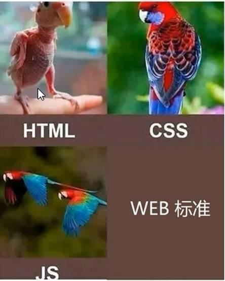

## HTML


### HTML标签


#### HTML语法规范

1. 标签由尖括号包围的关键词，标签成对出现（除一些特殊的标签）例如`<html></html>`，第一个标签为开始标签，第二个标签为结束标签

2. 有些特殊的单标签，例如`<br/>`

3. 标签关系

包含关系：`<head><title></title></head>`

并列关系： `<head></head>`

​                    `<body></body>`


#### HTML基本结构标签

每一个网页都会有一个基本的结构标签（也称之为骨架标签），页面内容也是在这些基本标签上书写

```html
<html>
    <head>
        <title>这是第一个网页</title>
    </head>
    <body>
        键盘敲烂，工资过万
    </body>
</html>
```


##### `<html></html>`

`HTML`标签	页面中最大的标签，我们称之为“根标签”


##### `<head></head>`

文档的头部	注意在head标签中我们必须要设置的标签是`title`


##### `<title></title>`

网页标题	在`head`标签内部，设置网页的标题


##### `<body></body>`

网页的主体	包含文档的所有内容

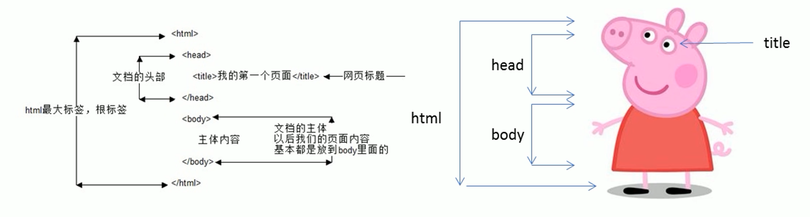


##### `<!DOCTYPE>`

文档类型声明	作用是告诉浏览器这个文件是使用哪种`HTML`版本来使用网页

`<!DOCTYPE html>`的意思是当前的页面采用的是`HTML5`版本来显示页面

**注意：**

1. `<!DOCTYPE>`声明位于文档中的最前面的位置，处于`<html>`标签的前面
2. `<!DOCTYPE>`不是一个`HTML`标签，它就是文档类型的声明标签


##### `<html lang="en">`

`lang`语言种类

1. `en`定义语言为英文
2. `zh-CN`定义语言为中文

实际上即使定义为`en`也可以显示中文，定义成`zh-CN`也可以显示英文，主要用于网页翻译上


##### `<meta charset="utf-8">`

字符集，位于`<head>`标签内，以便计算机能够识别和存储各种文字，`utf-8`被称为**万国码**


#### HTML常用标签 上


##### 标签语义

重点是记住每个标签的语义，简单理解就是指标签的含义，即这个标签是用来干嘛的

**根据标签的语义，在合适的地方给一个最合理的标签，可以让页面结构更清晰**


##### `<h1>-<h6>`标题标签

为了使网页更具有语义化，我们经常会在页面中使用到标题标签，加了标题的文字会加粗加大，并且独占一行

```html
<html>
    <head>
        <title>这是标题测试</title>
    </head>
    <body>
        <h1>
            这是一级标题
        </h1>
        <h2>
            这是二级标题
        </h2>
    </body>
</html>
```


##### `<p>`段落标签`<br/>`换行标签

`<p>我是一个段落</p>`文本在一个窗口中会根据浏览器的宽度自动换行

`<br/>`单标签，可以强制文本换行


##### 文本格式化标签

|  语义  |              标签              |                  说明                  |
| :----: | :----------------------------: | :------------------------------------: |
|  加粗  | `<strong></strong>`或`<b></b>` | 更推荐`<strong>`标签加粗，语义更加强烈 |
|  倾斜  |     `<em></em>`或`<i></i>`     |   更推荐`<em>`标签倾斜，语义更加强烈   |
| 删除线 |    `<del></del>`或`<s></s>`    | 更推荐`<del>`标签删除线，语义更加强烈  |
| 下划线 |    `<ins></ins>`或`<u></u>`    | 更推荐`<ins>`标签下划线，语义更加强烈  |


##### `<div>`和`<span>`

`<div>`和`<span>`是没有语义的，它们就是一个盒子，用来装内容，**非常经常用到**

`<div></div>`特点

1. 一行只能放一个`<div>`

`<span></span>`特点

1. 一行可以放置多个`<span>`


##### 图片标签``

插入图片``

其中的`src`属性是``标签的==必须属性==，它用于指定图像文件的**路径和文件名**

所谓**属性**：简单理解就是属于这个图像标签的特性

``

|   属性   |  属性值  |                  说明                  |
| :------: | :------: | :------------------------------------: |
|  `src`   | 图片路径 |          必须属性，图片的路径          |
|  `alt`   |   文本   | 替换文本，图像不能显示的时候显示的文字 |
| `title`  |   文本   |   提示文本，鼠标放到图像上显示的文本   |
| `width`  |   像素   |             设置图像的宽度             |
| `height` |   像素   |             设置图像的高度             |
| `border` |   像素   |           设置图像的边框粗细           |

**注意事项**

1. 图像标签属性必须写在标签名后面
2. 各个属性之间没有先后顺序，属性之间空格分开
3. 属性采取键值对的方式，即key = "value"


##### 路径

**目录文件夹和根目录**

实际工作中，我们的文件不能随便乱放，否则用起来很难快速的找到他们，因此我们需要一个文件夹来管理他们

**目录文件夹：**普通文件夹，里面只不过存放了我们做页面所需要的相关素材，比如html文件、图片等

**根目录：**打开目录文件夹的第一层文件夹就是根目录

**绝对路径：**是指目录的绝对位置，直接到达文件的位置，通常从盘符开始符号用\，网络上的绝对地址也可以用

**相对路径：**以引用文件所在位置为参考基础，而建立出的目录路径，可以看成图片相对于HTML文件的位置

| 相对路径分类 | 符号  |                             说明                             |
| :----------: | :---: | :----------------------------------------------------------: |
|  同一级路径  |       |    图像文件位于HTML文件同一级，如``     |
|  下一级路径  |  `/`  | 图像文件位于HTML文件下一级，如`` |
|  上一级路径  | `../` |   图像文件位于HTML文件上一级，如``   |


##### 超链接标签`<a>`

超链接的语法格式`<a href="跳转目标" target="目标窗口的弹出格式">文本或图像</a>`

|   属性   |                             作用                             |
| :------: | :----------------------------------------------------------: |
|  `href`  | 用于指定链接目标的url地址，（必须属性）当为标签应用href属性时，它就具有了超链接的功能 |
| `target` | 用于指定链接页面的打开方式，其中`_self`为默认值，`_blank`为在新窗口中打开 |

**链接的分类**

1. 外部链接：`<a href="https://www.baidu.com" target="_blank">百度</a>`

2. 内部链接：网站内部之间的相互链接`<a href="index.html" target="_blank">index</a>`

3. 空链接：`<a href="#" target="_blank">空连接</a>`

4. 下载链接：href里面写的是一个文件或压缩文件，点击时就会下载

5. 网页元素链接：在网页中的各种元素中国添加超链接`<a href="https://www.baidu.com" target="_blank"></a>`

6. 锚点链接：页面内的链接`<a href="#two">第二集</a>`标签位置`<h3 id="two">第二集介绍</h3>`


##### 注释标签和特殊字符

`<!--我是一条注释-->`

注释里的内容是给程序员看的，便于相关开发人员理解和阅读代码

特殊字符


#### HTML常用标签 下


##### 表格标签

**表格的主要作用**

表格主要用于显示、展示数据，因为它可以让数据显示的非常的规整，可读性非常好。特别是后台展示数据的时候，能够熟练的运用表格就显得很重要。一个清爽简约的表格能够把繁杂的数据表现得很有条理。

**表格基本语法**

```html
<table>
    <tr>
    <th>表头</th>
    <td>单元格内的文字</td>
    ...
    </tr>
    ...
</table>
```

`<table></table>`是用于定义表格的标签

`<tr></tr>`标签用于定义表格中的行，必须嵌套在`<table></table>`标签中

`<td></td>`标签用于输入单元格的内容

`<th></th>`表头单元格，内部的文字会加粗居中显示，常用于表格的第一行

**表格属性**

不常用，后面都是使用CSS来设置表格样式


**表格结构标签**

因为表格可能很长，为了更好的表示表格的语义，可以将表格分割成表格头部和表格主体两大部分。在表格标签中，分别用：`<thead>`标签表格的头部区域、`<tbody>`标签表格的主题区域。这样可以更好的分清表格结构。

```html
<table>
    
    <thead>
    <tr>
         <th></th> <th></th> <th></th> <th></th>...
    </tr>
    </thead>
    <tbody>
    <tr></tr> 
    <tr></tr>
    <tr></tr>
    <tr></tr>
    ...
    </tbody>
</table>
```

**合并单元格**

合并单元格的方式：

1. 跨行合并：rowspan="合并单元格的个数"
2. 跨列合并：colspan="合并单元格的个数"

合并单元格的步骤：

1. 先确定是跨行还是跨列合并
2. 找到目标单元格（上或左），写上合并的单元格数量，比如：`<td colspan="2"></td>`
3. 删除多余的单元格


##### 列表标签

列表是用来布局的，列表最大的特点就是整齐、整洁、有序，他作为布局会更加自由和方便

**列表的分类**

无序列表（重点）

`<ul>`标签里只能嵌套`<li>`，但是`<li>`是一个容器，里面可以加其他元素，`<ul>`自带一些属性，但是实际开发的时候会用CSS来实现属性

```html
<ul>
    <li>列表项1</li>
    <li>列表项2</li>
    <li>列表项3</li>
    ...
</ul>
```


有序列表

`<ol>`会自动给出序号，自带属性使用CSS实现，同上

```html
<ol>
    <li>列表项1</li>
    <li>列表项2</li>
    <li>列表项3</li>
    ...
</ol>
```


自定义列表

`<dl>`标签用于定义描述列表（或自定义列表），该标签会与`<dt>`(定义项目/名字)和`<dd>`（描述每一个项目/名字）一起使用，同上

```html
<dl>
    <dt>名词1</dt>
    <dd>名词1解释1</dd>
    <dd>名词1解释2</dd>
    ...
</dl>
```


##### 表单标签

例如在注册的时候填写信息的界面可以使用表单，收集用户信息

**表单的组成**

在HTML中一个完整的表单由==表单域、表单控件（也称表单元素）和提示信息==构成

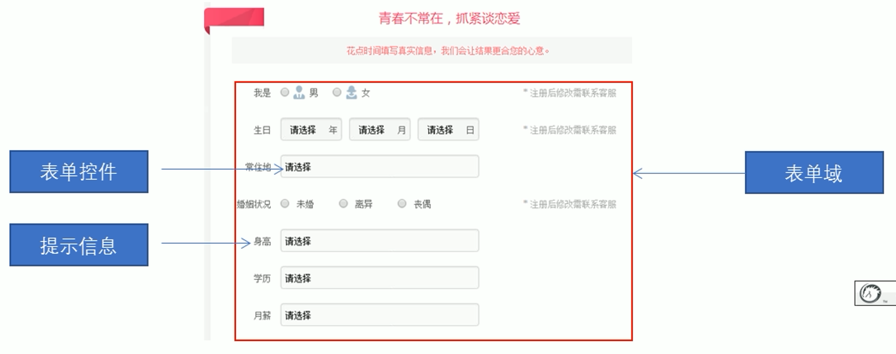

**表单域**

表单域是一个包含表单元素的区域

在HTML标签中`<form>`标签用于定义表单域，以实现用户信息的收集和传递，`<form>`会把它范围内的表单元素信息提交给服务器

```html
<form action="url地址" method="提交方式" name="表单域名称">
    各种表单元素控件
</form>
```

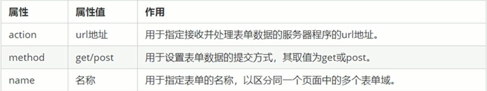

**表单控件**

1. input输入表单元素
2. select下拉表单元素
3. textarea文本域元素

**input输入表单元素**：用于收集用户信息

在`<input>`标签中，包含一个`type`属性，根据不同的type属性，输入字段拥有很多种形式（可以是文本字段、复选框、掩码后的文本控件、单选按钮、按钮等）`<input type="属性值"/>`

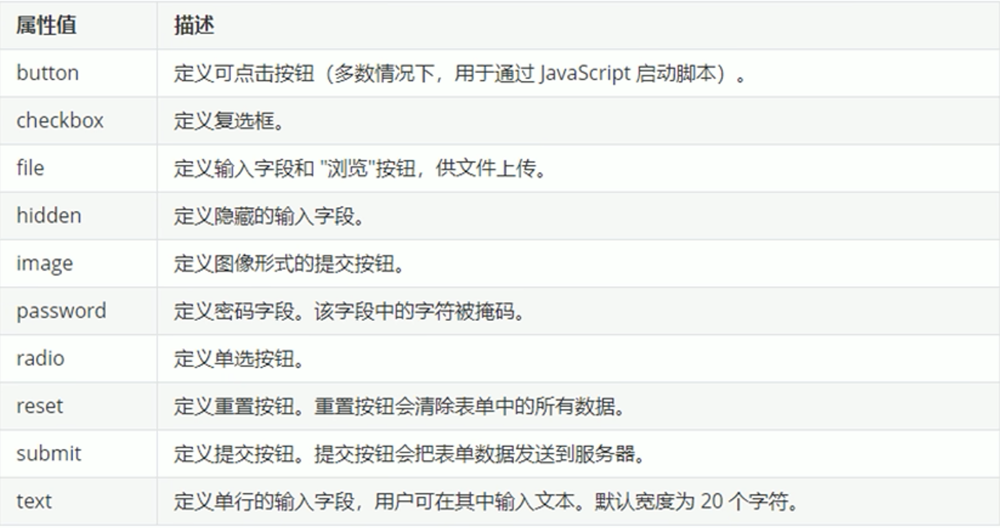

```html
    <form>
      用户名：<input type="text" name="userName" maxlength="6"/> <br/>
      密码：<input type="password" name="passWord"/> <br/>
      <!--radio单选按钮，必须由相同的name属性-->
      婚姻状况：
        已婚<input type="radio" name="marriage" value="married"/> 
        未婚<input type="radio" name="marriage" value="unmarried"/> <br/>
      <!--checkbox复选按钮-->
      爱好：
        音乐<input type="checkbox" name="hobby"/> 
        吃饭<input type="checkbox" name="hobby"/> 
        睡觉<input type="checkbox" name="hobby"/> 
        打豆豆<input type="checkbox" name="hobby"/> <br/>
        选择文件<input type="file" name="file"> <br/>
        同意协议<input type="radio" name="agree" checked>
      <input type="submit" value="提交">
      <input type="reset" value="重新填写">
      <input type="button" value="获取短信验证码">
    </form>
```

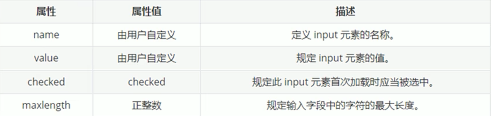

`<lable>`标签

`<label>`标签为input元素定义标注，用于绑定一个表单元素，当点击`<label>`标签内的文本时，浏览器就会自动将焦点（光标）转到或者选择对应的表单元素上，用来增加用户体验

```html
<label for="sex">男</label>
<input type="radio" name="sex" id="sex"/>
<label for="text">用户名:</label>
<input type="text" name="userName" maxlength="6" id="text"/>
<!--其中for属性应当与相关元素的id属性相同-->
```

**select下拉表单元素**

在页面中有多个选项供用户选择，并且想要节约页面空间时，我们可以使用`<select>`标签控件定义下拉列表

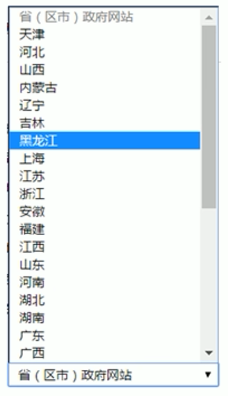

```html
请选择：
<select>
    <option>选项1</option>
    <option>选项2</option>
    <option selected="selected">选项3</option>
    <option>选项3</option>
    ...
</select>
<!--selected为默认属性-->
```

**textarea文本域元素**

使用场景：当用户输入内容较多的情况下，我们就不能使用文本框表单了，此时我们使用`<textarea>`标签

```html
 <label for="textarea">请输入：</label>
      <textarea rows="5" cols="40" id="textarea">
        
      </textarea>
```

实际开发中是使用CSS来设定输入框的大小


#### 查询文档

经常查阅文档是一个非常好的习惯

推荐的网址

百度：www.baidu.com

W3C：www.w3school.com.cn

MDN：https://developer.mozilla.org/zh-CN/


## CSS

### CSS简介

参考：https://www.w3school.com.cn/cssref/index.asp

CSS的主要使用场景就是美化网页，布局页面的

1. HTML的局限性：只关注内容的语义，不关注样式
2. CSS-网页的美容师

CSS是**层叠样式表**(Cascading Style Sheets)的简称，有时我们也会称之为**CSS样式表**或**级联样式表**，也是一种标记语言，CSS主要用于设置HTML页面中的**文本内容**(字体、大小、对齐方式等)、**图片的外形**(宽高、边框样式、边距等)以及**版面的布局和外观显示样式**


### CSS语法规范

CSS样式规则

CSS规则由两个主要的部分构成：==选择器==以及一条或多条==声明==

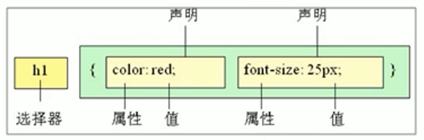

`<style></style>`标签在`<head></head>`标签内。在里面写CSS样式

```css
<style>
      /*选择器{样式}*/
      /*给谁改{改成什么样}*/
      p{
        color: red;
      }
</style>
```

**选择器**是用于指定CSS样式的**HTML标签**，大括号内是对该对象设置的具体样式

属性和属性值以”键值对“的形式出现


### CSS代码风格

1. 样式格式书写

   1. 紧凑型

      ```css
      h1 {color: red; font-size: 25px;}
      ```

   2. 展开型

      ```css
      h1 {
          color: red;
          font-size: 25px;
      }
      ```

      

2. 样式大小写：推荐小写，虽然大写也能运行

3. 空格：属性值前，冒号后面，保留一个空格，选择器(标签)和大括号之间保留一个空格


### CSS基础选择器

#### 作用

选择器(选择符)就是根据不同需求把不同的标签选出来，这就是选择器的作用。简单来说，就是**选择标签用的**

#### 分类

<a href="doc/Web前端开发规范手册.doc">类命名规范</a>

选择器分为**基础选择器**和**复合选择器**

基础选择器：

1. 基础选择器是由单个选择器组成的

2. 基础选择器又包括：**标签选择器、类选择器（.class）（开发最常用）、id选择器(#id)和通配符选择器**

   类选择器-多类名`<div class="red font20"></div>`多类名之间用空格分开

   ```html
   <!DOCTYPE html>
   <html lang="zh-CN">
     <head>
       <meta charset="UTF-8">
       <title>多类目测试</title>
       <style>
         .red {
           color: red;
         }
         .font35 {
           font-size: 30px;
         }
         .box {
           width: 200px;
           height: 200px;
         }
         .burlywoodB {
           background-color: burlywood;
         }
         #mike {
           color: deeppink;
         }
       </style>
     </head>
     <body>
       <div class="red font35 box burlywoodB">
         test
       </div>
       <div class="box burlywoodB" id="mike">
         mike jackson
       </div>
     </body>
   </html>
   ```

   id选择器实际上只能调用一次，其他标签不会再出现相同的id

|                            选择器                            |         例子          |                       例子描述                       |
| :----------------------------------------------------------: | :-------------------: | :--------------------------------------------------: |
| [.*class*](https://www.w3school.com.cn/cssref/selector_class.asp) |        .intro         |           选择 class="intro" 的所有元素。            |
|                      .*class1*.*class2*                      |     .name1.name2      | 选择 class 属性中同时有 name1 和 name2 的所有元素。  |
|                     .*class1* .*class2*                      |     .name1 .name2     |  选择作为类名 name1 元素后代的所有类名 name2 元素。  |
| [#*id*](https://www.w3school.com.cn/cssref/selector_id.asp)  |      #firstname       |             选择 id="firstname" 的元素。             |
|   [*](https://www.w3school.com.cn/cssref/selector_all.asp)   |           *           |                    选择所有元素。                    |
| [*element*](https://www.w3school.com.cn/cssref/selector_element.asp) |           p           |                 选择所有 <p> 元素。                  |
| [*element*.*class*](https://www.w3school.com.cn/cssref/selector_element_class.asp) |        p.intro        |         选择 class="intro" 的所有 <p> 元素。         |
| [*element*,*element*](https://www.w3school.com.cn/cssref/selector_element_comma.asp) |        div, p         |         选择所有 <div> 元素和所有 <p> 元素。         |
| [*element* *element*](https://www.w3school.com.cn/cssref/selector_element_element.asp) |         div p         |          选择 <div> 元素内的所有 <p> 元素。          |
| [*element*>*element*](https://www.w3school.com.cn/cssref/selector_element_gt.asp) |        div > p        |         选择父元素是 <div> 的所有 <p> 元素。         |
| [*element*+*element*](https://www.w3school.com.cn/cssref/selector_element_plus.asp) |        div + p        |         选择紧跟 <div> 元素的首个 <p> 元素。         |
| [*element1*~*element2*](https://www.w3school.com.cn/cssref/selector_gen_sibling.asp) |        p ~ ul         |        选择前面有 <p> 元素的每个 <ul> 元素。         |
| [[*attribute*\]](https://www.w3school.com.cn/cssref/selector_attribute.asp) |       [target]        |           选择带有 target 属性的所有元素。           |
| [[*attribute*=*value*\]](https://www.w3school.com.cn/cssref/selector_attribute_value.asp) |    [target=_blank]    |      选择带有 target="_blank" 属性的所有元素。       |
| [[*attribute*~=*value*\]](https://www.w3school.com.cn/cssref/selector_attribute_value_contain.asp) |    [title~=flower]    |    选择 title 属性包含单词 "flower" 的所有元素。     |
| [[*attribute*\|=*value*\]](https://www.w3school.com.cn/cssref/selector_attribute_value_start.asp) |      [lang\|=en]      |       选择 lang 属性值以 "en" 开头的所有元素。       |
| [[*attribute*^=*value*\]](https://www.w3school.com.cn/cssref/selector_attr_begin.asp) |   a[href^="https"]    |  选择其 src 属性值以 "https" 开头的每个 <a> 元素。   |
| [[*attribute*$=*value*\]](https://www.w3school.com.cn/cssref/selector_attr_end.asp) |    a[href$=".pdf"]    |    选择其 src 属性以 ".pdf" 结尾的所有 <a> 元素。    |
| [[*attribute**=*value*\]](https://www.w3school.com.cn/cssref/selector_attr_contain.asp) |  a[href*="w3school"]  | 选择其 href 属性值中包含 "abc" 子串的每个 <a> 元素。 |
| [:active](https://www.w3school.com.cn/cssref/selector_active.asp) |       a:active        |                    选择活动链接。                    |
| [::after](https://www.w3school.com.cn/cssref/selector_after.asp) |       p::after        |           在每个 <p> 的内容之后插入内容。            |
| [::before](https://www.w3school.com.cn/cssref/selector_before.asp) |       p::before       |           在每个 <p> 的内容之前插入内容。            |
| [:checked](https://www.w3school.com.cn/cssref/selector_checked.asp) |     input:checked     |           选择每个被选中的 <input> 元素。            |
| [:default](https://www.w3school.com.cn/cssref/selector_default.asp) |     input:default     |              选择默认的 <input> 元素。               |
| [:disabled](https://www.w3school.com.cn/cssref/selector_disabled.asp) |    input:disabled     |           选择每个被禁用的 <input> 元素。            |
| [:empty](https://www.w3school.com.cn/cssref/selector_empty.asp) |        p:empty        |   选择没有子元素的每个 <p> 元素（包括文本节点）。    |
| [:enabled](https://www.w3school.com.cn/cssref/selector_enabled.asp) |     input:enabled     |            选择每个启用的 <input> 元素。             |
| [:first-child](https://www.w3school.com.cn/cssref/selector_first-child.asp) |     p:first-child     |    选择属于父元素的第一个子元素的每个 <p> 元素。     |
| [::first-letter](https://www.w3school.com.cn/cssref/selector_first-letter.asp) |    p::first-letter    |             选择每个 <p> 元素的首字母。              |
| [::first-line](https://www.w3school.com.cn/cssref/selector_first-line.asp) |     p::first-line     |              选择每个 <p> 元素的首行。               |
| [:first-of-type](https://www.w3school.com.cn/cssref/selector_first-of-type.asp) |    p:first-of-type    |   选择属于其父元素的首个 <p> 元素的每个 <p> 元素。   |
| [:focus](https://www.w3school.com.cn/cssref/selector_focus.asp) |      input:focus      |             选择获得焦点的 input 元素。              |
| [:fullscreen](https://www.w3school.com.cn/cssref/selector_fullscreen.asp) |      :fullscreen      |               选择处于全屏模式的元素。               |
| [:hover](https://www.w3school.com.cn/cssref/selector_hover.asp) |        a:hover        |             选择鼠标指针位于其上的链接。             |
| [:in-range](https://www.w3school.com.cn/cssref/selector_in-range.asp) |    input:in-range     |         选择其值在指定范围内的 input 元素。          |
| [:indeterminate](https://www.w3school.com.cn/cssref/selector_indeterminate.asp) |  input:indeterminate  |          选择处于不确定状态的 input 元素。           |
| [:invalid](https://www.w3school.com.cn/cssref/selector_invalid.asp) |     input:invalid     |          选择具有无效值的所有 input 元素。           |
| [:lang(*language*)](https://www.w3school.com.cn/cssref/selector_lang.asp) |      p:lang(it)       |  选择 lang 属性等于 "it"（意大利）的每个 <p> 元素。  |
| [:last-child](https://www.w3school.com.cn/cssref/selector_last-child.asp) |     p:last-child      |    选择属于其父元素最后一个子元素每个 <p> 元素。     |
| [:last-of-type](https://www.w3school.com.cn/cssref/selector_last-of-type.asp) |    p:last-of-type     |   选择属于其父元素的最后 <p> 元素的每个 <p> 元素。   |
| [:link](https://www.w3school.com.cn/cssref/selector_link.asp) |        a:link         |               选择所有未访问过的链接。               |
| [:not(*selector*)](https://www.w3school.com.cn/cssref/selector_not.asp) |        :not(p)        |             选择非 <p> 元素的每个元素。              |
| [:nth-child(*n*)](https://www.w3school.com.cn/cssref/selector_nth-child.asp) |    p:nth-child(2)     |   选择属于其父元素的第二个子元素的每个 <p> 元素。    |
| [:nth-last-child(*n*)](https://www.w3school.com.cn/cssref/selector_nth-last-child.asp) |  p:nth-last-child(2)  |           同上，从最后一个子元素开始计数。           |
| [:nth-of-type(*n*)](https://www.w3school.com.cn/cssref/selector_nth-of-type.asp) |   p:nth-of-type(2)    |   选择属于其父元素第二个 <p> 元素的每个 <p> 元素。   |
| [:nth-last-of-type(*n*)](https://www.w3school.com.cn/cssref/selector_nth-last-of-type.asp) | p:nth-last-of-type(2) |         同上，但是从最后一个子元素开始计数。         |
| [:only-of-type](https://www.w3school.com.cn/cssref/selector_only-of-type.asp) |    p:only-of-type     |   选择属于其父元素唯一的 <p> 元素的每个 <p> 元素。   |
| [:only-child](https://www.w3school.com.cn/cssref/selector_only-child.asp) |     p:only-child      |    选择属于其父元素的唯一子元素的每个 <p> 元素。     |
| [:optional](https://www.w3school.com.cn/cssref/selector_optional.asp) |    input:optional     |       选择不带 "required" 属性的 input 元素。        |
| [:out-of-range](https://www.w3school.com.cn/cssref/selector_out-of-range.asp) |  input:out-of-range   |          选择值超出指定范围的 input 元素。           |
| [::placeholder](https://www.w3school.com.cn/cssref/selector_placeholder.asp) |  input::placeholder   |     选择已规定 "placeholder" 属性的 input 元素。     |
| [:read-only](https://www.w3school.com.cn/cssref/selector_read-only.asp) |    input:read-only    |      选择已规定 "readonly" 属性的 input 元素。       |
| [:read-write](https://www.w3school.com.cn/cssref/selector_read-write.asp) |   input:read-write    |      选择未规定 "readonly" 属性的 input 元素。       |
| [:required](https://www.w3school.com.cn/cssref/selector_required.asp) |    input:required     |      选择已规定 "required" 属性的 input 元素。       |
| [:root](https://www.w3school.com.cn/cssref/selector_root.asp) |         :root         |                  选择文档的根元素。                  |
| [::selection](https://www.w3school.com.cn/cssref/selector_selection.asp) |      ::selection      |              选择用户已选取的元素部分。              |
| [:target](https://www.w3school.com.cn/cssref/selector_target.asp) |     #news:target      |             选择当前活动的 #news 元素。              |
| [:valid](https://www.w3school.com.cn/cssref/selector_valid.asp) |      input:valid      |          选择带有有效值的所有 input 元素。           |
| [:visited](https://www.w3school.com.cn/cssref/selector_visited.asp) |       a:visited       |                选择所有已访问的链接。                |


### CSS的复合选择器

复合选择器是建立在基础选择器之上，对基本选择器进行组合形成的

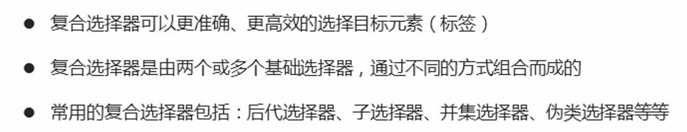

#### 后代选择器

**后代选择器**又称为*包含选择器*，可以选择父元素里面子元素。其写法就是把外层标签写在前面，内层标签写在后面，中间用空格分割。当标签发生嵌套时，内层标签称为外层标签的后代

==元素1和元素2可以是任意基础选择器==

`元素1 元素2 ...{样式声明}`

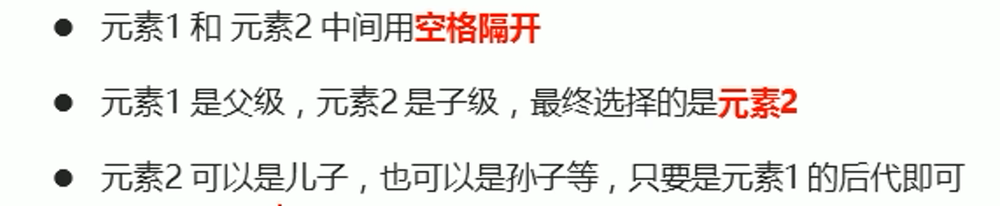


#### 子选择器

子元素选择器(重要)只能选择作为某元素的最近一级子元素。简单理解就是选亲儿子元素

```html
<!DOCTYPE html>
<html lang="zh-CN">
<head>
    <meta charset="UTF-8">
    <meta http-equiv="X-UA-Compatible" content="IE=edge">
    <meta name="viewport" content="width=device-width, initial-scale=1.0">
    <title>Document</title>
    <style>
        /* 子辈选择器，只选择儿子 */
        div>strong {
            color: pink;
        }
    </style>
</head>
<body>
    <div>
        <!--变成粉色-->
        <strong>儿子</strong>
        <strong>儿子</strong>
        <strong>儿子</strong>
    </div>
    <div>
        <p>
            <strong>孙子</strong>
            <strong>孙子</strong>
            <strong>孙子</strong>
        </p>
    </div>
</body>
</html>
```


#### 交集选择器

交集选择器由两个选择器构成，找到标签必须满足复合标签一也符合标签二

```html
<!DOCTYPE html>
<html lang="en">

<head>
    <meta charset="UTF-8">
    <meta http-equiv="X-UA-Compatible" content="IE=edge">
    <meta name="viewport" content="width=device-width, initial-scale=1.0">
    <title>Document</title>
    <style>
        /* 需求，让p.red变成红色 */
        p.red {
            color: red;
        }

        div.red {
            color: red;
        }

        p {
            color: blue;
        }
    </style>
</head>

<body>
    <p class="red">红色</p>
    <p class="red">红色</p>
    <p class="red">红色</p>
    <div class="red">红色</div>
    <div class="red">红色</div>
    <div class="red">红色</div>
    <p>蓝色</p>
    <p>蓝色</p>
    <p>蓝色</p>
</body>

</html>
```


#### 并集选择器

```html
<!DOCTYPE html>
<html lang="en">

<head>
    <meta charset="UTF-8">
    <meta http-equiv="X-UA-Compatible" content="IE=edge">
    <meta name="viewport" content="width=device-width, initial-scale=1.0">
    <title>Document</title>
    <style>
        /* p和span变红 */
        p,
        span {
            color: red;
            font-size: 16px
        }
    </style>
</head>

<body>
    <p>我和你</p>
    <p>我和你</p>
    <p>我和你</p>
    <span>我和你</span>
    <span>我和你</span>
    <span>我和你</span>
    <div>我和你</div>
    <div>我和你</div>
    <div>我和你</div>
    <h1>我和你</h1>
    <h1>我和你</h1>
    <h1>我和你</h1>
</body>

</html>
```

#### 伪类选择器

伪类选择器用冒号，比如`:link{}`

用于向某些选择器添加特殊的效果。比如给链接添加特殊效果，比如可以选择第一个，第n个元素。

##### 链接伪类选择器

浏览器会自动给链接一个默认的样式，因此我们在实际的工作中需要单独给链接设置格式

1. `a:link /*未访问的链接*/`
2. `a:visited /*已访问的链接*/`
3. `a:hover /*鼠标移动到的链接*/`
4. `a:active /*选定的链接*/`

```html
<!DOCTYPE html>
<html lang="en">

<head>
    <meta charset="UTF-8">
    <meta http-equiv="X-UA-Compatible" content="IE=edge">
    <meta name="viewport" content="width=device-width, initial-scale=1.0">
    <title>Document</title>
    <style>
        /* 最好顺序不要变化 */
        /* 未访问的链接 正常状态 */
        a:link {
            color: black;
            /* 取消下划线 */
            text-decoration: none;
        }

        /* 已经访问的链接 我们点击过的 */
        a:visited {
            color: orange;
        }

        /* 鼠标经过链接的状态 */
        a:hover {
            color: red;
        }

        /* 选中链接时的状态 */
        a:active {
            color: green;
        }
    </style>
</head>

<body>
    <a href="http://www.xiaomi.com" target="_blank">小米手机</a>
    <a href="#">大米手机</a>
</body>

</html>
```


### 常用属性


#### font属性


##### font-family

定义和用法

font-family 规定元素的字体系列。

font-family 可以把多个字体名称作为一个“回退”系统来保存。如果浏览器不支持第一个字体，则会尝试下一个。也就是说，font-family 属性的值是用于某个元素的字体族名称或/及类族名称的一个优先表。浏览器会使用它可识别的第一个值。

有两种类型的字体系列名称：

- 指定的系列名称：具体字体的名称，比如："times"、"courier"、"arial"。
- 通常字体系列名称：比如："serif"、"sans-serif"、"cursive"、"fantasy"、"monospace"

**提示：**使用逗号分割每个值，并始终提供一个类族名称作为最后的选择。

**注意：**使用某种特定的字体系列（Geneva）完全取决于用户机器上该字体系列是否可用；这个属性没有指示任何字体下载。因此，强烈推荐使用一个通用字体系列名作为后路。

```css
/*多个单词组成的字体使用''或""包起来; 浏览器执行的时候会先看第一个字体有无，没有的话看第二个，以此类推*/
body {
    font-family: 'Microsoft YaHei', Arial, Helvetica, sans-serif;
}
```


##### font-size

定义和用法

font-size 属性可设置字体的尺寸。

说明

该属性设置元素的字体大小。注意，实际上它设置的是字体中字符框的高度；实际的字符字形可能比这些框高或矮（通常会矮）。

各关键字对应的字体必须比一个最小关键字相应字体要高，并且要小于下一个最大关键字对应的字体。

```css
/*注意标题比较特殊，需要单独设置字体大小；谷歌默认16px*/
body {
    font-size: 20px;
}
```


|                              值                              |                             描述                             |
| :----------------------------------------------------------: | :----------------------------------------------------------: |
| xx-small<br/>x-small<br/>small<br/>medium<br/>large<br/>x-large<br/>xx-large | 把字体的尺寸设置为不同的尺寸，从 xx-small 到 xx-large。默认值：medium。 |
|                           smaller                            |           把 font-size 设置为比父元素更小的尺寸。            |
|                            larger                            |           把 font-size 设置为比父元素更大的尺寸。            |
|                           *length*                           |              把 font-size 设置为一个固定的值。               |
|                             *%*                              |        把 font-size 设置为基于父元素的一个百分比值。         |
|                           inherit                            |                 规定应该从父元素继承字体尺寸                 |


##### font-weight

定义和用法

font-weight 属性设置文本的粗细。

说明

该属性用于设置显示元素的文本中所用的字体加粗。数字值 400 相当于 关键字 normal，700 等价于 bold。每个数字值对应的字体加粗必须至少与下一个最小数字一样细，而且至少与下一个最大数字一样粗。

```css
/*实际开发中更提倡使用数字*/
body {
    font-weight: normal;
    /*700等价于bold*/
    font-weight: 700;
}
```


| 值                                          | 描述                                                        |
| :------------------------------------------ | :---------------------------------------------------------- |
| normal                                      | 默认值。定义标准的字符。                                    |
| bold                                        | 定义粗体字符。                                              |
| bolder                                      | 定义更粗的字符。                                            |
| lighter                                     | 定义更细的字符。                                            |
| 100  200  300  400  500  600  700  800  900 | 定义由粗到细的字符。400 等同于 normal，而 700 等同于 bold。 |
| inherit                                     | 规定应该从父元素继承字体的粗细。                            |


##### font-style

定义和用法

font-style 属性定义字体的风格。

说明

该属性设置使用斜体、倾斜或正常字体。斜体字体通常定义为字体系列中的一个单独的字体。理论上讲，用户代理可以根据正常字体计算一个斜体字体。

```css
p {
    font-style: normal;
}
```


|   值    |                  描述                  |
| :-----: | :------------------------------------: |
| normal  | 默认值。浏览器显示一个标准的字体样式。 |
| italic  |    浏览器会显示一个斜体的字体样式。    |
| oblique |    浏览器会显示一个倾斜的字体样式。    |
| inherit |     规定应该从父元素继承字体样式。     |


##### font复合属性

一行代码设定属性，简写的方式

```css
/*顺寻不能任意颠倒*/
/*不需要的属性可以省略或者设置默认值，但是font-size和font-family属性必须保留，否则font属性不起作用*/
body {
    font: font-style font-weight font-size/line-weight font-family;
}

body{
    font: italic 700 16px 'Microsoft YaHei'
}
```


##### font总结：

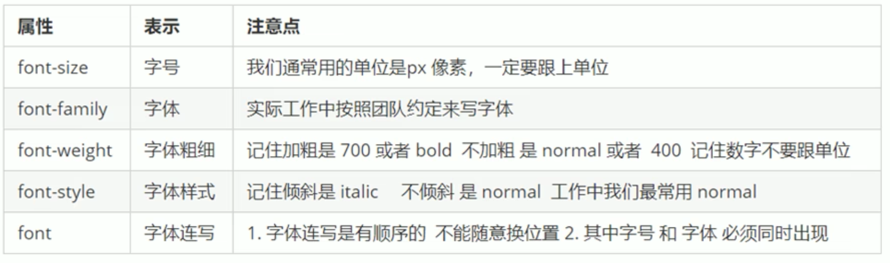


#### TEXT属性

##### color属性

定义和用法

color 属性规定文本的颜色。

这个属性设置了一个元素的前景色（在 HTML 表现中，就是元素文本的颜色）；光栅图像不受 color 影响。这个颜色还会应用到元素的所有边框，除非被 border-color 或另外某个边框颜色属性覆盖。

要设置一个元素的前景色，最容易的方法是使用 color 属性。

```css
div {
    color: red;
}
```

|     描述     |                                                    |
| :----------: | :------------------------------------------------: |
| *color_name* |      规定颜色值为颜色名称的颜色（比如 red）。      |
| *hex_number* |   规定颜色值为十六进制值的颜色（比如 #ff0000）。   |
| *rgb_number* | 规定颜色值为 rgb 代码的颜色（比如 rgb(255,0,0)）。 |
|   inherit    |             规定应该从父元素继承颜色。             |

##### text-align

定义和用法

text-align 属性规定元素中的文本的==水平对齐==方式。

该属性通过指定行框与哪个点对齐，从而设置块级元素内文本的水平对齐方式。通过允许用户代理调整行内容中字母和字之间的间隔，可以支持值 justify；不同用户代理可能会得到不同的结果。

|   值    |                    描述                    |
| :-----: | :----------------------------------------: |
|  left   |  把文本排列到左边。默认值：由浏览器决定。  |
|  right  |             把文本排列到右边。             |
| center  |             把文本排列到中间。             |
| justify |           实现两端对齐文本效果。           |
| inherit | 规定应该从父元素继承 text-align 属性的值。 |

**值 justify**

最后一个水平对齐属性是 justify，它会带来自己的一些问题。

值 justify 可以使文本的两端都对齐。在两端对齐文本中，文本行的左右两端都放在父元素的内边界上。然后，调整单词和字母间的间隔，使各行的长度恰好相等。您也许已经注意到了，两端对齐文本在打印领域很常见。不过在 CSS 中，还需要多做些考虑。

要由用户代理（而不是 CSS）来确定两端对齐文本如何拉伸，以填满父元素左右边界之间的空间。例如，有些浏览器可能只在单词之间增加额外的空间，而另外一些浏览器可能会平均分布字母间的额外空间（不过 CSS 规范特别指出，如果 [letter-spacing 属性](https://www.w3school.com.cn/cssref/pr_text_letter-spacing.asp)指定为一个长度值，“用户代理不能进一步增加或减少字符间的空间”）。还有一些用户代理可能会减少某些行的空间，使文本挤得更紧密。所有这些做法都会影响元素的外观，甚至改变其高度，这取决于用户代理的对齐选择影响了多少文本行。

CSS 也没有指定应当如何处理连字符（注1）。大多数两端对齐文本都使用连字符将长单词分开放在两行上，从而缩小单词之间的间隔，改善文本行的外观。不过，由于 CSS 没有定义连字符行为，用户代理不太可能自动加连字符。因此，在 CSS 中，两端对齐文本看上去没有打印出来好看，特别是元素可能太窄，以至于每行只能放下几个单词。当然，使用窄设计元素是可以的，不过要当心相应的缺点。

**注1：**CSS 中没有说明如何处理连字符，因为不同的语言有不同的连字符规则。规范没有尝试去调和这样一些很可能不完备的规则，而是干脆不提这个问题。

##### text-decoration

定义和用法

text-decoration 属性规定添加到文本的修饰。

**注释：**修饰的颜色由 "color" 属性设置。

说明

这个属性允许对文本设置某种效果，如加下划线。如果后代元素没有自己的装饰，祖先元素上设置的装饰会“延伸”到后代元素中。不要求用户代理支持 blink。

```css
p {
    text-decoration: none;
}
```


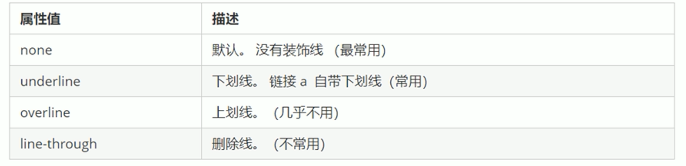

**属性值**

|                              值                              |                           描述                           |
| :----------------------------------------------------------: | :------------------------------------------------------: |
| [text-decoration-line](https://www.w3school.com.cn/cssref/pr_text-decoration-line.asp) |   设置要使用的文本装饰类型（如下划线、上划线、划线）。   |
| [text-decoration-color](https://www.w3school.com.cn/cssref/pr_text-decoration-color.asp) |                   设置文字装饰的颜色。                   |
| [text-decoration-style](https://www.w3school.com.cn/cssref/pr_text-decoration-style.asp) | 设置文本装饰的样式（如实心、波浪形、点线、虚线、双线）。 |
| [text-decoration-thickness](https://www.w3school.com.cn/cssref/pr_text_text-decoration-thickness.asp) |                    设置装饰线的粗细。                    |
|                           initial                            |         将此属性设置为其默认值。请参阅 initial。         |
|                           inherit                            |          从其父元素继承此属性。请参阅 inherit。          |


##### text-indent缩进

定义

text-indent 属性规定文本块中首行文本的缩进。

**注释：**允许使用负值。如果使用负值，那么首行会被缩进到左边。

**注意：**在 CSS 2.1 之前，text-indent 总是继承计算值，而不是声明值。

说明

用于定义块级元素中第一个内容行的缩进。这最常用于建立一个“标签页”效果。允许指定负值，这会产生一种“悬挂缩进”的效果。

```css
/*根据文字大小缩进，缩进两个字符的大小*/
p {
    text-indent: 2em;
}
```


属性值

|    值    |                    描述                     |
| :------: | :-----------------------------------------: |
| *length* |         定义固定的缩进。默认值：0。         |
|   *%*    |     定义基于父元素宽度的百分比的缩进。      |
| inherit  | 规定应该从父元素继承 text-indent 属性的值。 |


##### line-height行间距

定义和用法

line-height 属性设置**行间的距离（行高）**。

**注释：**不允许使用负值。

说明

该属性会影响行框的布局。在应用到一个**块级元素**时，它定义了该元素中基线之间的**最小距离而不是最大距离**。

line-height 与 font-size 的计算值之差（在 CSS 中成为“行间距”）分为两半，分别加到一个文本行内容的顶部和底部。可以包含这些内容的最小框就是行框。

原始数字值指定了一个缩放因子，后代元素会继承这个缩放因子而不是计算值。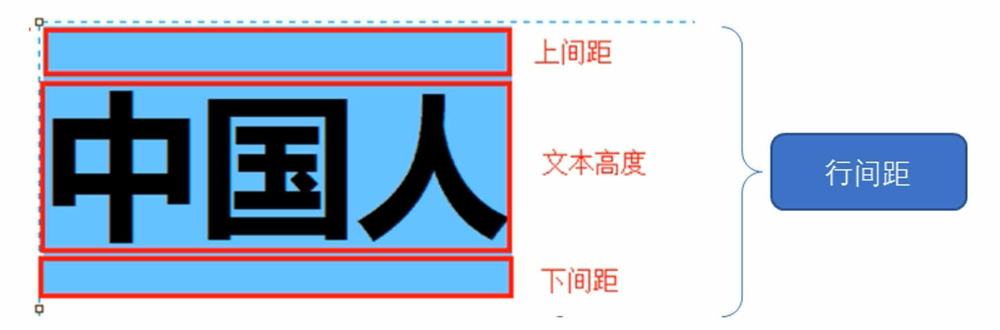

|    值    |                         描述                         |
| :------: | :--------------------------------------------------: |
|  normal  |               默认。设置合理的行间距。               |
| *number* | 设置数字，此数字会与当前的字体尺寸相乘来设置行间距。 |
| *length* |                  设置固定的行间距。                  |
|   *%*    |           基于当前字体尺寸的百分比行间距。           |
| inherit  |     规定应该从父元素继承 line-height 属性的值。      |

##### 总结

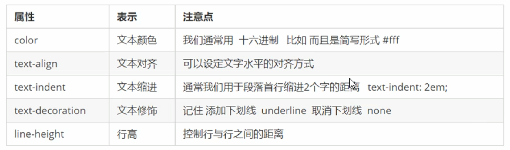


### CSS的引入方式

**分类**

1. 行内样式表（行内式）

   行内样式表是在元素标签内部的style属性中设定CSS样式，适合修改简单样式

   ```html
   <p style="color: red; font-size: 25px">
       给我一个粉红色的回忆
   </p>
   ```

   

2. 内部样式表（嵌入式）

   内部样式表是写到html页面内部，是将所有的CSS代码抽取出来，单独放到一个`<style>`标签内

   理论上`<style>`理论上可以放到html任意标签内部，但是约定放到`<head>`内部，内部样式一般练习的时候使用

   

3. 外部样式表（链接式）

   实际开发都是外部样式表，适合样式比较多的情况，核心是：样式单独写到CSS文件中，之后把CSS文件引入到html页面中使用

   引入外部样式表分为两步：

   1. 新建一个后缀名为.css的样式文件，把所有css代码都放入此文件中

   2. 在html页面中，使用`<link>`标签引入这个文件

      `<link rel="stylesheet" href="css文件路径">`

      

#### 总结

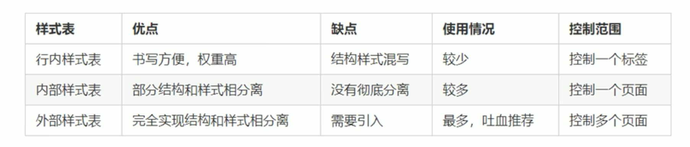

#### Emmet语法

Emmet语法的前身是Zen coding，它使用缩写来提高html/css的编写速度，vscode内部已经集成了改语法

##### 快速生成HTML结构语法

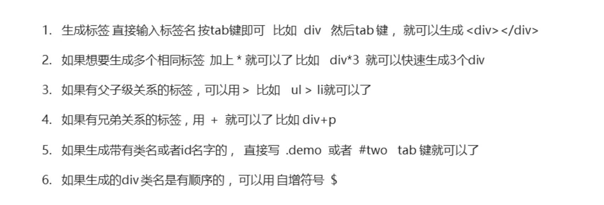

##### 快速生成CSS样式语法

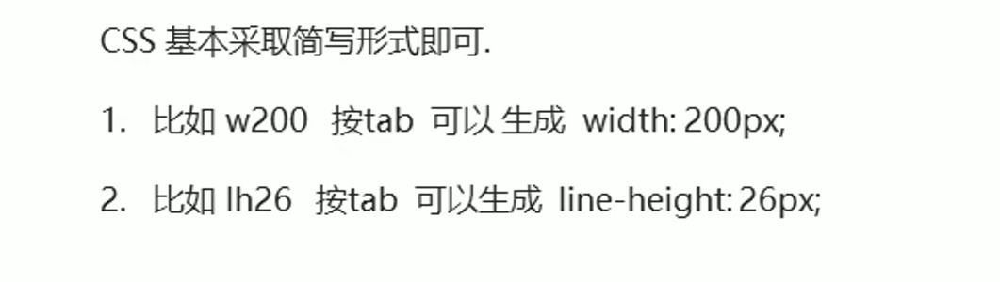

### 标签显示模式

标签以什么方式显示，比如`<div>`独占一行、`<span>`一行可以放很多个

#### 块级元素(block-level)

比如说`<h1>~<h6>、<p>、<div>、<ul>、<ol>、<li>`等，其中`<div>`是典型的块元素

**特点**

1. 自己独占一行
2. 高度、宽度、外边距以及内边距都可以控制
3. 宽度默认是容器（父级宽度）的100%
4. 是一个容器盒子，里面可以放行内或者块级元素

**注意**

1. 只有文字才能组成段落，因此p里面不能放块级元素，特别是p里面不能放div
2. 同理还有h1~h6这些都是文字类块级标签，里面不能放其他块级元素

```html
<!DOCTYPE html>
<html lang="en">

<head>
    <meta charset="UTF-8">
    <meta http-equiv="X-UA-Compatible" content="IE=edge">
    <meta name="viewport" content="width=device-width, initial-scale=1.0">
    <title>Document</title>
    <style>
        div.nav {
            height: 200px;
            width: 200px;
            /* 背景颜色 */
            background-color: pink;
        }

        div.sitenav {
            height: 200px;
            width: 1000px;
            background-color: greenyellow;
        }
    </style>
</head>

<body>
    <div class="nav">我是一个块级元素div</div>
    <div class="nav">我是一个块级元素div</div>
    <div class="sitenav">
        <span>我是span</span>
        <span>我是span</span>
        <span>我是span</span>
        <span>我是span</span>
        <span>我是span</span>
    </div>
</body>

</html>
```


#### 行内元素(inline-level)

`<a>、<strong>、<b>、<em>、<i>、<del>、<s>、<ins>、<u>、<span>`等，其中`<span>`是最常见的行内元素

**特点**

1. 相邻行内元素在一行上，一行可以显示多个
2. 高、宽度直接设置是==无效的==
3. 默认宽度是它==本身内容的宽度==
4. 行内元素只能容纳文本或其他行内元素

**注意**

1. 链接里面不能再放链接
2. 特殊情况a里面可以放块级元素，但是给a转换一下块级模式最安全

```html
<!DOCTYPE html>
<html lang="en">

<head>
    <meta charset="UTF-8">
    <meta http-equiv="X-UA-Compatible" content="IE=edge">
    <meta name="viewport" content="width=device-width, initial-scale=1.0">
    <title>Document</title>
    <style>
        /* 直接设置宽度无效，高宽 */
        span {
            width: 200px;
            height: 200px;
            background-color: pink;
        }
    </style>
</head>

<body>
    <span>我是行内元素</span>
    <span>我是行内元素</span>
    <span>我是行内元素</span>
</body>

</html>
```


#### 行内块元素(inline-block)

在行内元素有几个特殊的标签`、<input>、<td>`，可以对它们设置宽高和对齐属性

**特点**

1. 一行可以显示多个
2. 默认宽高由本身的内容决定
3. 可以设置宽高和对齐属性

#### 显示模式的相互转换

块转行内：display:inline;

行转块内：display:block;

块、行内元素转换为行内块：display:inline-block;

**属性值**

| 值                 | 描述                                                         |
| :----------------- | :----------------------------------------------------------- |
| none               | 此元素不会被显示。                                           |
| block              | 此元素将显示为块级元素，此元素前后会带有换行符。             |
| inline             | 默认。此元素会被显示为内联元素，元素前后没有换行符。         |
| inline-block       | 行内块元素。（CSS2.1 新增的值）                              |
| list-item          | 此元素会作为列表显示。                                       |
| run-in             | 此元素会根据上下文作为块级元素或内联元素显示。               |
| compact            | CSS 中有值 compact，不过由于缺乏广泛支持，已经从 CSS2.1 中删除。 |
| marker             | CSS 中有值 marker，不过由于缺乏广泛支持，已经从 CSS2.1 中删除。 |
| table              | 此元素会作为块级表格来显示（类似 `<table>`），表格前后带有换行符。 |
| inline-table       | 此元素会作为内联表格来显示（类似 `<table>`），表格前后没有换行符。 |
| table-row-group    | 此元素会作为一个或多个行的分组来显示（类似 `<tbody>`）。     |
| table-header-group | 此元素会作为一个或多个行的分组来显示（类似 `<thead>`）。     |
| table-footer-group | 此元素会作为一个或多个行的分组来显示（类似 `<tfoot>`）。     |
| table-row          | 此元素会作为一个表格行显示（类似 `<tr>`）。                  |
| table-column-group | 此元素会作为一个或多个列的分组来显示（类似 `<colgroup>`）。  |
| table-column       | 此元素会作为一个单元格列显示（类似 `<col>`）                 |
| table-cell         | 此元素会作为一个表格单元格显示（类似 `<td>` 和 `<th>`）      |
| table-caption      | 此元素会作为一个表格标题显示（类似 `<caption>`）             |
| inherit            | 规定应该从父元素继承 display 属性的值。                      |

```css
a {
    display: inline-block;
    width: 80px;
    height: 25px;
    background-color: red;
}
```

#### 行高

行高的测量

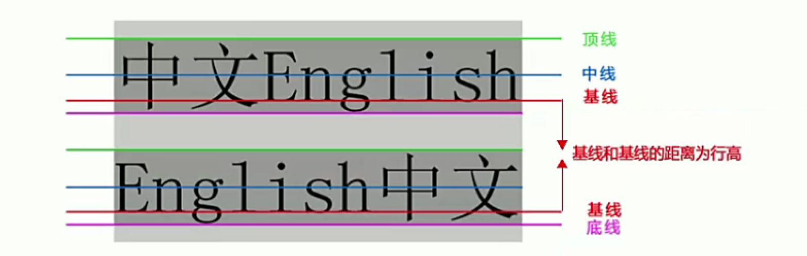

##### 单行文本垂直居中

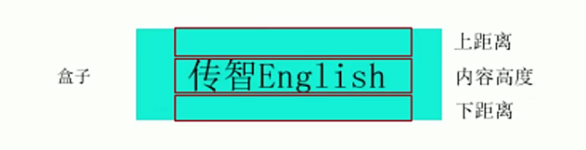

```css
  div {
            /* 行高和盒子的宽度相同即可 */
            width: 100px;
            height: 40px;
            font-size: 16px;
            background-color: pink;
            line-height: 40px;
            text-align: center;
        }
```

**行高和高度的三种关系**

height > line-height：字的显示偏上

height = line-height：字的显示居中

height < line-height：字的显示偏下


### CSS背景(background)

**属性值**

| 值                                                           | 描述                                             | CSS  |
| :----------------------------------------------------------- | :----------------------------------------------- | :--- |
| *[background-color](https://www.w3school.com.cn/cssref/pr_background-color.asp)* | 规定要使用的背景颜色。                           | 1    |
| *[background-position](https://www.w3school.com.cn/cssref/pr_background-position.asp)* | 规定背景图像的位置。                             | 1    |
| *[background-size](https://www.w3school.com.cn/cssref/pr_background-size.asp)* | 规定背景图片的尺寸。                             | 3    |
| *[background-repeat](https://www.w3school.com.cn/cssref/pr_background-repeat.asp)* | 规定如何重复背景图像。                           | 1    |
| *[background-origin](https://www.w3school.com.cn/cssref/pr_background-origin.asp)* | 规定背景图片的定位区域。                         | 3    |
| *[background-clip](https://www.w3school.com.cn/cssref/pr_background-clip.asp)* | 规定背景的绘制区域。                             | 3    |
| *[background-attachment](https://www.w3school.com.cn/cssref/pr_background-attachment.asp)* | 规定背景图像是否固定或者随着页面的其余部分滚动。 | 1    |
| *[background-image](https://www.w3school.com.cn/cssref/pr_background-image.asp)* | 规定要使用的背景图像。                           | 1    |
| inherit                                                      | 规定应该从父元素继承 background 属性的设置。     | 1    |


#### 背景颜色(color)

**定义和用法**

`background-color` 属性设置元素的背景颜色。

**元素背景的范围**

`background-color` 属性为元素设置一种纯色。这种颜色会填充元素的内容、内边距和边框区域，扩展到元素边框的外边界（但不包括外边距）。如果边框有透明部分（如虚线边框），会透过这些透明部分显示出背景色。

**		**

尽管在大多数情况下，没有必要使用 `transparent`。不过如果您不希望某元素拥有背景色，同时又不希望用户对浏览器的颜色设置影响到您的设计，那么设置 `transparent` 值还是有必要的。

| 值           | 描述                                                   |
| :----------- | :----------------------------------------------------- |
| *color_name* | 规定颜色值为颜色名称的背景颜色（比如 red）。           |
| *hex_number* | 规定颜色值为十六进制值的背景颜色（比如 #ff0000）。     |
| *rgb_number* | 规定颜色值为 rgb 代码的背景颜色（比如 rgb(255,0,0)）。 |
| transparent  | 默认。背景颜色为透明。                                 |
| inherit      | 规定应该从父元素继承 background-color 属性的设置。     |

```css
div {
    width: 300px;
    height: 300px;
    background-color: pink;
}
```


#### 背景图片(image)

**定义和用法**

`background-image` 属性为元素设置背景图像。

元素的背景占据了元素的全部尺寸，包括内边距和边框，但不包括外边距。

默认地，背景图像位于元素的左上角，并在水平和垂直方向上重复。

**提示：**请设置一种可用的背景颜色，这样的话，假如背景图像不可用，页面也可获得良好的视觉效果。

详细说明

background-image 属性会在元素的背景中设置一个图像。

根据 [background-repeat](https://www.w3school.com.cn/cssref/pr_background-repeat.asp) 属性的值，图像可以无限平铺、沿着某个轴（x 轴或 y 轴）平铺，或者根本不平铺。

初始背景图像（原图像）根据 [background-position](https://www.w3school.com.cn/cssref/pr_background-position.asp) 属性的值放置。

| 值           | 描述                                               |
| :----------- | :------------------------------------------------- |
| url('*URL*') | 指向图像的路径。                                   |
| none         | 默认值。不显示背景图像。                           |
| inherit      | 规定应该从父元素继承 background-image 属性的设置。 |

```css
.bg {
    width: 300px;
    height: 300px;
    background-color: pink;
    /*不提倡这里的url加引号，虽然加引号也能加载*/
    background-image: url(url);
}
```


#### 背景平铺(repeat)

**定义和用法**

`background-repeat` 属性设置是否及如何重复背景图像。

默认地，背景图像在水平和垂直方向上重复。

**详细说明**

background-repeat 属性定义了图像的平铺模式。

从原图像开始重复，原图像由 [background-image](https://www.w3school.com.cn/cssref/pr_background-image.asp) 定义，并根据 [background-position](https://www.w3school.com.cn/cssref/pr_background-position.asp) 的值放置。

**属性值**

| 值        | 描述                                                |
| :-------- | :-------------------------------------------------- |
| repeat    | 默认。背景图像将在垂直方向和水平方向重复。          |
| repeat-x  | 背景图像将在水平方向重复。                          |
| repeat-y  | 背景图像将在垂直方向重复。                          |
| no-repeat | 背景图像将仅显示一次。                              |
| inherit   | 规定应该从父元素继承 background-repeat 属性的设置。 |

```css
.bg {
    width: 300px;
    height: 300px;
    background-color: pink;
    /*不提倡这里的url加引号，虽然加引号也能加载*/
    background-image: url(url);
    /*背景不平铺*/
    background-repeat: no-repeat;
}
```


#### 背景位置(position)重点

**定义和用法**

`background-position` 属性设置背景图像的起始位置。

这个属性设置背景原图像（由 [background-image](https://www.w3school.com.cn/cssref/pr_background-image.asp) 定义）的位置，背景图像如果要重复，将从这一点开始。

**提示：**需要把 background-attachment 属性设置为 "`fixed`"，才能保证该属性在 Firefox 和 Opera 中正常工作。

**注意：**

1. 必须先指定background-image属性
2. position后面是x坐标和y坐标，可以使用方位名词或精确单位
3. 如果指定两个值，两个值都是方位名字，则这两个值前后顺序无关
4. 如郭指定两个值，精确单位和方位名字混合使用，则第一个值是x坐标，第二个值是y坐标

**属性值**

| 值                                                           | 描述                                                         |
| :----------------------------------------------------------- | :----------------------------------------------------------- |
| top left<br/>top center<br/>top right<br/>center left<br/>center center<br/>center right<br/>bottom left<br/>bottom center<br/>bottom right | 如果您仅规定了一个关键词，那么第二个值将是"center"。默认值：0% 0%。 |
| x% y%                                                        | 第一个值是水平位置，第二个值是垂直位置。左上角是 0% 0%。右下角是 100% 100%。如果您仅<br/>规定了一个值，另一个值将是 50%。 |
| xpos ypos                                                    | 第一个值是水平位置，第二个值是垂直位置。左上角是 0 0。单位是像素 (0px 0px) 或任何其他的<br/> CSS 单位。如果您仅规定了一个值，另一个值将是50%。您可以混合使用 % 和 position 值。 |

```css
body{ 
	background-image:url(bgimage.gif);
	background-repeat:no-repeat;
	background-attachment:fixed;
    /*水平居中*/
	background-position:center center;
}
```


#### 背景附着(attachment)

**定义和用法**

`background-attachment` 属性设置背景图像是否固定或者随着页面的其余部分滚动。默认是滚动的

**属性值**

| 值      | 描述                                                    |
| :------ | :------------------------------------------------------ |
| scroll  | 默认值。背景图像会随着页面其余部分的滚动而移动。        |
| fixed   | 当页面的其余部分滚动时，背景图像不会移动。              |
| inherit | 规定应该从父元素继承 background-attachment 属性的设置。 |


#### 背景简写

background：属性的值的书写顺序官方没有强制标准的。为了可读性，建议这样写：

`background:背景颜色 背景图片地址 背景平铺 背景附着 背景位置`


#### 背景透明(CSS3)

原理：叠加一个半透明的盒子，可以实现鼠标移动到相关区域时，区域颜色加深

背景半透明是指盒子的背景半透明，盒子里面的内容不受影响

因为是CSS3，所以低于IE9的版本是不支持的

```css
 <style>
        /* rgba的第四个数是透明度，取值范围是0-1 */
        .alpha {
            width: 300px;
            height: 300px;
            background: rgba(0, 0, 0, 0.3);
        }
    </style>
```


#### 背景总结

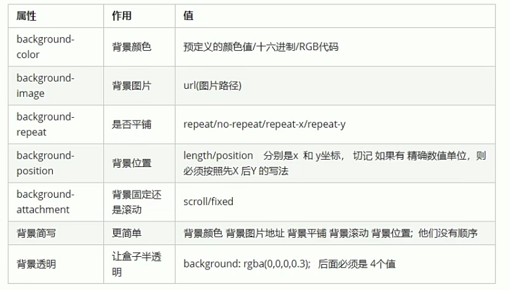


### CSS的三大特性


#### CSS层叠性

**长江后浪推前浪，前浪死在沙滩上**

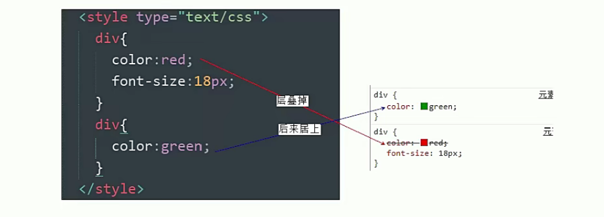

所谓层叠行是指多种CSS样式的叠加

是浏览器处理冲突的一个能力，如果一个属性通过两个相同选择器设置到同一个元素上，那么这个时候一个属性就会将另一个属性层叠掉

**原则：**

1. 样式冲突，遵循的原则是就近原则，哪个样式离结构近，就执行哪个样式
2. 样式不冲突的话就不会重叠


#### CSS继承性

**概念：**

1. 子标签会继承父标签的某些样式，如文本颜色和字号
2. 想要设置一个可继承的属性，只需要将它应用于父元素即可

简单理解就是：子承父业

**注意：**

1. 恰当地使用继承可以简化代码，降低CSS样式的复杂性。比如有很多子级孩子都需要某个样式，可以给父级指定一个，这些还在继承过来就好了
2. 子元素可以继承父元素的样式(text-，font-，line-这些开头的可以继承，以及color属性)


#### CSS优先级（重点）

##### 权重计算公式

定义CSS样式时，经常出现两个或更多规则作用在同一元素上，此时

1. 若选择器相同，这执行层叠性
2. 选择器不同，就会出现优先级的问题

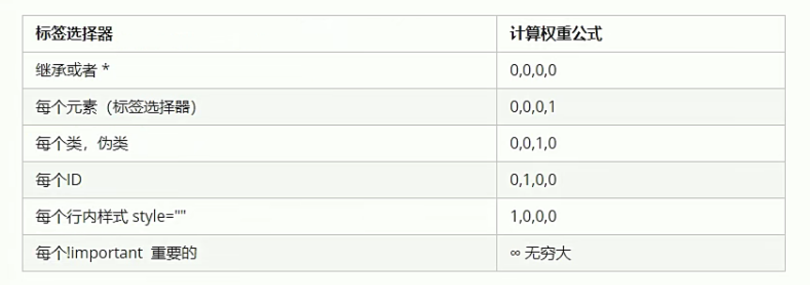

```html
<!DOCTYPE html>
<html lang="en">

<head>
    <meta charset="UTF-8">
    <meta http-equiv="X-UA-Compatible" content="IE=edge">
    <meta name="viewport" content="width=device-width, initial-scale=1.0">
    <title>Document</title>
    <style>
        /*执行后的颜色是red*/
        /*0,0,1,0*/
        .one {
            color: red!important; /*权重最高，无穷大*/
        }
        /*0,0,0,1*/
        div {
            color: pink;
        }
        /*0,1,0,0*/
        #two {
            color: blue;
        }
    </style>
</head>

<body>
    <div class="one" id="two">优先级问题</div>
</body>

</html>
```


##### 权重叠加

我们经常使用交集选择器，后代选择器等，是有多个基础选择器组合而成，那么此时，就会出现权重叠加，就是一个简单的加法计算


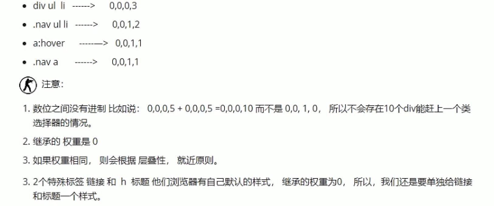

##### 继承的权重为0

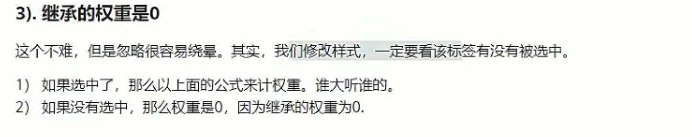


### 盒子模型


#### 盒子阴影

**定义和用法**

box-shadow 属性向框添加一个或多个阴影。

**提示：**请使用 border-image-* 属性来构造漂亮的可伸缩按钮！

**属性值**

| 值         | 描述                                     | 测试                                                         |
| :--------- | :--------------------------------------- | :----------------------------------------------------------- |
| *h-shadow* | 必需。水平阴影的位置。允许负值。         | [测试](https://www.w3school.com.cn/tiy/c.asp?f=css_box-shadow) |
| *v-shadow* | 必需。垂直阴影的位置。允许负值。         | [测试](https://www.w3school.com.cn/tiy/c.asp?f=css_box-shadow) |
| *blur*     | 可选。模糊距离。                         | [测试](https://www.w3school.com.cn/tiy/c.asp?f=css_box-shadow&p=3) |
| *spread*   | 可选。阴影的尺寸。                       | [测试](https://www.w3school.com.cn/tiy/c.asp?f=css_box-shadow&p=7) |
| *color*    | 可选。阴影的颜色。请参阅 CSS 颜色值。    | [测试](https://www.w3school.com.cn/tiy/c.asp?f=css_box-shadow&p=10) |
| inset      | 可选。将外部阴影 (outset) 改为内部阴影。 |                                                              |


#### 盒子模型（box model）

组成部分：

1. 内容
2. 边框
3. 内边距
4. 外边距

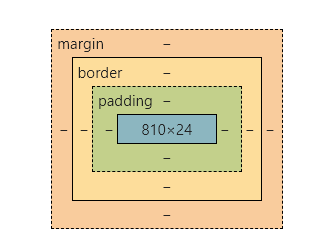


#### 盒子边距（border）

**定义和用法**

border 简写属性在一个声明设置所有的边框属性。

可以按顺序设置如下属性：

- [border-width](https://www.w3school.com.cn/cssref/pr_border-width.asp)
- [border-style](https://www.w3school.com.cn/cssref/pr_border-style.asp)（必需）
- [border-color](https://www.w3school.com.cn/cssref/pr_border-color.asp)

如果不设置其中的某个值，也不会出问题，比如 border:solid #ff0000; 也是允许的。

**属性值**

| 值             | 描述                                                         |
| :------------- | :----------------------------------------------------------- |
| *border-width* | 规定边框的宽度。参阅：[border-width](https://www.w3school.com.cn/cssref/pr_border-width.asp) 中可能的值。 |
| *border-style* | 规定边框的样式。参阅：[border-style](https://www.w3school.com.cn/cssref/pr_border-style.asp) 中可能的值。 |
| *border-color* | 规定边框的颜色。参阅：[border-color](https://www.w3school.com.cn/cssref/pr_border-color.asp) 中可能的值。 |
| inherit        | 规定应该从父元素继承 border 属性的设置。                     |

##### border-width

**定义和用法**

border-width 简写属性为元素的所有边框设置宽度，或者单独地为各边边框设置宽度。

只有当边框样式不是 none 时才起作用。如果边框样式是 none，边框宽度实际上会重置为 0。不允许指定负长度值。

**属性值**

| 值       | 描述                           |
| :------- | :----------------------------- |
| thin     | 定义细的边框。                 |
| medium   | 默认。定义中等的边框。         |
| thick    | 定义粗的边框。                 |
| *length* | 允许您自定义边框的宽度。       |
| inherit  | 规定应该从父元素继承边框宽度。 |

##### border-style

**定义和用法**

border-style 属性用于设置元素所有边框的样式，或者单独地为各边设置边框样式。

只有当这个值不是 none 时边框才可能出现。

**属性值**

| 值      | 描述                                                         |
| :------ | :----------------------------------------------------------- |
| none    | 定义无边框。                                                 |
| hidden  | 与 "none" 相同。不过应用于表时除外，对于表，hidden 用于解决边框冲突。 |
| dotted  | 定义点状边框。在大多数浏览器中呈现为实线。                   |
| dashed  | 定义虚线。在大多数浏览器中呈现为实线。                       |
| solid   | 定义实线。                                                   |
| double  | 定义双线。双线的宽度等于 border-width 的值。                 |
| groove  | 定义 3D 凹槽边框。其效果取决于 border-color 的值。           |
| ridge   | 定义 3D 垄状边框。其效果取决于 border-color 的值。           |
| inset   | 定义 3D inset 边框。其效果取决于 border-color 的值。         |
| outset  | 定义 3D outset 边框。其效果取决于 border-color 的值。        |
| inherit | 规定应该从父元素继承边框样式。                               |

##### border-color

**定义和用法**

border-color 属性设置四条边框的颜色。此属性可设置 1 到 4 种颜色。

border-color 属性是一个简写属性，可设置一个元素的所有边框中可见部分的颜色，或者为 4 个边分别设置不同的颜色。

**属性值**

| 值           | 描述                                                   |
| :----------- | :----------------------------------------------------- |
| *color_name* | 规定颜色值为颜色名称的边框颜色（比如 red）。           |
| *hex_number* | 规定颜色值为十六进制值的边框颜色（比如 #ff0000）。     |
| *rgb_number* | 规定颜色值为 rgb 代码的边框颜色（比如 rgb(255,0,0)）。 |
| transparent  | 默认值。边框颜色为透明。                               |
| inherit      | 规定应该从父元素继承边框颜色。                         |

##### border简写

`border: width style color;`

##### examples

```html
<!DOCTYPE html>
<html lang="en">

<head>
    <meta charset="UTF-8">
    <meta http-equiv="X-UA-Compatible" content="IE=edge">
    <meta name="viewport" content="width=device-width, initial-scale=1.0">
    <title>Document</title>
    <style>
        div {
            width: 200px;
            height: 200px;
            /*等价于border: 5px solid pink*/
            border-width: 5px;
            border-style: solid;
            border-color: pink;
        }
    </style>
</head>

<body>
    <div></div>
</body>

</html>
```

##### 盒子的上下左右边框

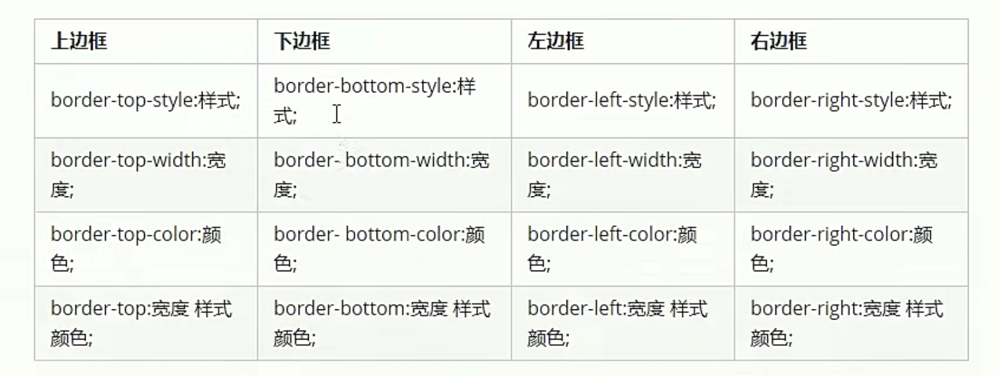

##### 表格的细线边框

通过表格的`cellspacing=0`，将单元格于单元格之间的距离设置为0

但是两个单元格之间的边框会出现重叠，从而使得边框变粗

通过CSS属性:

`table { border-collapse: collapse; }

collapse单词是合并的意思

border-collapse: collapse; 表示相邻边框合并在一起

```css
table{
    width: 500px;
    height: 500px;
    border: 1px solid red;
}

td {
    border: 1px solid red;
    text-align: center;
}

table, td {
    /*合并相邻的边框*/
    border-collapse: cpllapse;
}
```


##### 圆角边框

`border-radius: length;`

可以让一个正方形变成圆：

`border-radius: 50%`

矩形两边变成圆边：

```css
p {
    width: 100px;
    height: 20px;
    nackground-color: red;
    font-size: 12px;
    color: white;
    text-align: center;
    line-height: 20px;
    border-radius: 10px;
}
```


#### 内边距（padding）

padding属性用于设置内边距。是指边框内容与内容之间的距离

若没有给盒子指定宽度，则padding不会撑开盒子

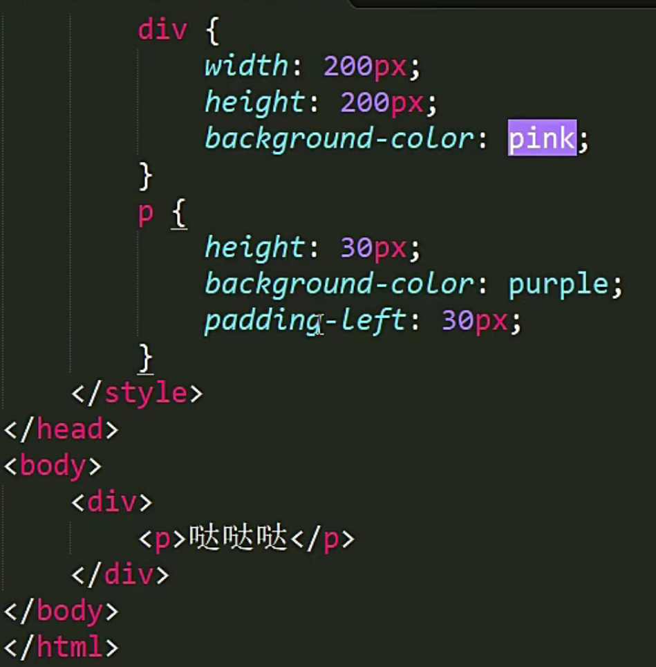

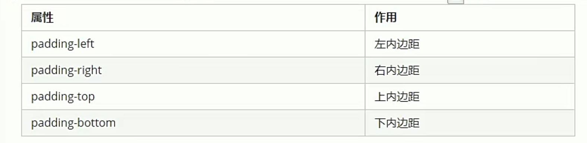

##### padding简写

padding可以“撑开”盒子

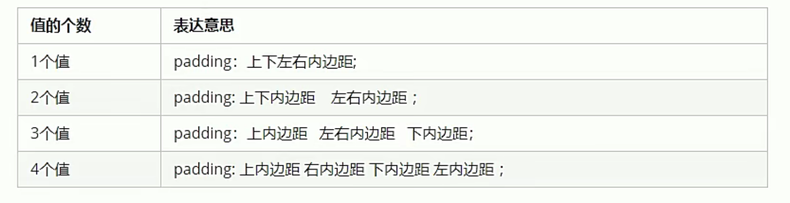

##### 内盒尺寸计算（元素实际大小）

- 宽度

  Element Height = content height + padding + border

- 高度

  Element Width = content width + padding + border

- 盒子的实际大小= 内容的宽度和高度 + 内边距 + 边框

​	


#### 外边距（margin）

**定义和用法**

margin 简写属性在一个声明中设置所有外边距属性。该属性可以有 1 到 4 个值。

**说明**

这个简写属性设置一个元素所有外边距的宽度，或者设置各边上外边距的宽度。

块级元素的垂直相邻外边距会合并，而行内元素实际上不占上下外边距。行内元素的的左右外边距不会合并。同样地，浮动元素的外边距也不会合并。允许指定负的外边距值，不过使用时要小心。

**注释：**允许使用负值。

**属性值**

| 值       | 描述                                                         |
| :------- | :----------------------------------------------------------- |
| auto     | 浏览器计算外边距。                                           |
| *length* | 规定以具体单位计的外边距值，比如像素、厘米等。默认值是 0px。 |
| *%*      | 以包含元素宽度的百分比指定外边距。                           |
| inherit  | 规定应该从父元素继承外边距。                                 |

##### margin-top

##### margin-bottom

##### margin-left

##### margin-right

##### 简写

简写的方式和padding一样

##### 块级盒子水平居中

- 可以让一个块级盒子实现水平居中必须：
  - 盒子必须指定了宽度（width）
  - 然后就给**左右的外边距设置为auto**

实际工作中常用这种方式进行网页布局，示例代码如下：

`.header { width: 960px; margin: 0 auto; }`

常见写法：

- margin: auto;
- margin: 0 auto;
- margin-left: auto; margin-right: auto;

行内元素和行内块元素水平居中对齐使用text-align: center;

##### 插入图片和背景图片的区别

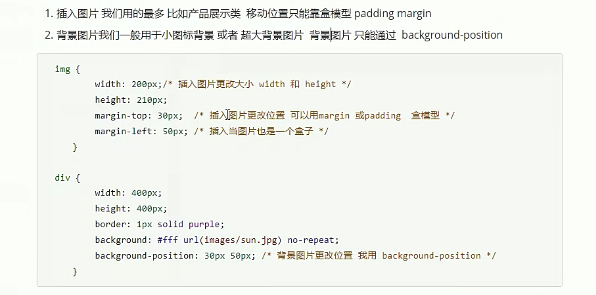


##### 清除元素默认的外边距

为了更灵活方面的控制网页中的元素，制作网页时，我们需要将元素的默认内外边距清除

代码：

```css
* {
    padding: 0;/*清除内边距*/
    margin: 0;/*清除外边距*/
}
```

**注意**

- 行内元素为了照顾兼容性，尽量只设置左右内外边距，不要设置上下内外边距

##### 外边距合并

使用margin定义块元素的垂直外边距时，可能出现外边距的合并

###### 相邻块元素垂直外边距的合并

- 当上下相邻的两个块元素相遇时，如果上面的元素有下外边距margin-bottom
- 下面的元素有上外边距margin-top，则他们之间的垂直间距不是margin-bottom于margin-top之和
- **取两个值中的较大者**这种现象被称为相邻块元素垂直外边距的合并（也称外边距塌陷）

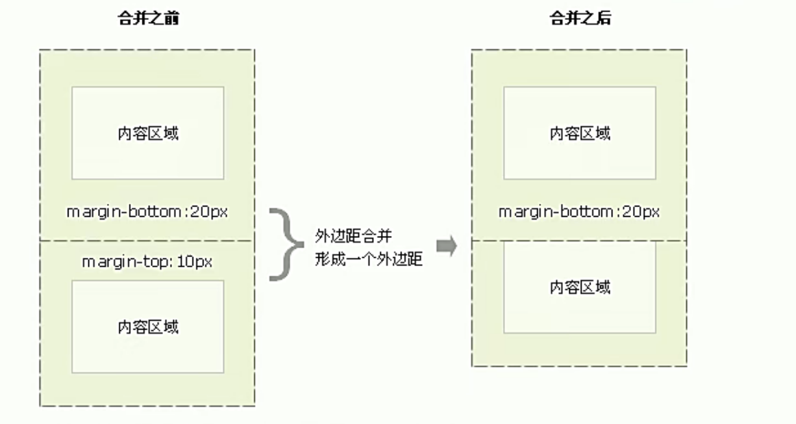

**解决方案：尽量只给一个盒子添加margin值**

###### 嵌套块元素垂直外边距的合并

- 对于两个嵌套关系的块元素，如果父元素没有上内边距及边框
- 父元素的上外边距会于子元素的上外边距发生合并
- 合并后的外边距为两者中的较大者

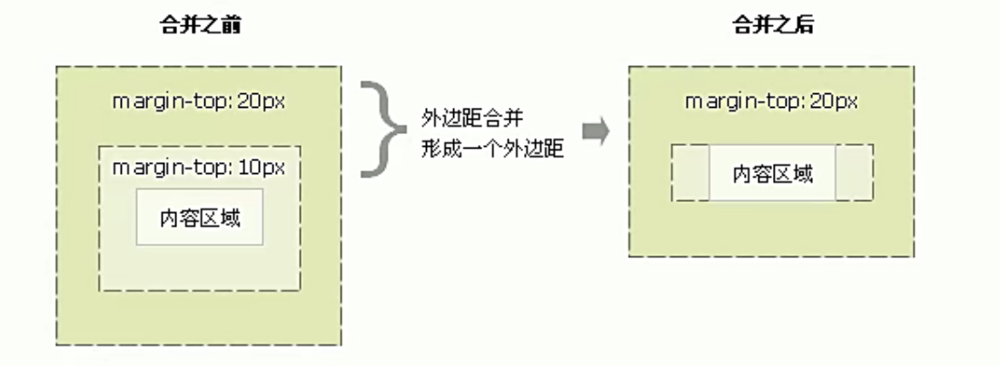

**解决方案：**

- 可以为父元素定义上边框
- 可以为父元素定义上内边距
- 可以为父元素添加overflow: hidden;


#### 盒子模型布局稳定性

什么情况下用内边距，什么情况用外边距？

- 大部分情况下是可以混用的，就是说，你用内边距也可以，用外边距也可以。你觉得哪个方便就用哪一个

我们根据稳定性来分建议如下：

按照优先使用宽度width其次使用内边距padding再次外边距margin

`width > padding > margin`

**原因：**

- margin会有外边距合并，还有IE6下面margin加倍的bug，所以最后使用
- padding会影响盒子的大小，需要进行加减计算，其次使用
- width没有问题，经常使用高度剩余法和宽度剩余法来做

### 浮动(float)

#### css布局的三种方式

`网页布局的核心就是用css来摆放盒子`

CSS提供了三种机制来设置盒子的摆放位置，分别是普通流(标准流)、浮动和定位

- 普通流
  - **块级元素**会独占一行，**从上到下**顺序显示
    - 常用元素：`div hr p h1~h6 ul ol dl form table`
  - **行内元素****会按照顺序**从左到右**顺序排列，碰到父元素边缘则自动换行
    - 常用元素：`span a i em`等
- 浮动
  - 让盒子从普通流中**浮**起来，主要作用让多个块级盒子一行显示
- 定位
  - 让盒子定在浏览器的某一个位置--css离不开定位，特别是后面的js特效

#### 为什么需要浮动？

在实际业务开发中需要让多个盒子在同一行，普通流的实现方式会出现盒子之间的间隔问题,并且不能实现两个盒子分别左对齐和右对齐

```html
<!DOCTYPE html>
<html lang="zh-CN">

<head>
    <meta charset="UTF-8">
    <meta http-equiv="X-UA-Compatible" content="IE=edge">
    <meta name="viewport" content="width=device-width, initial-scale=1.0">
    <title>Document</title>
    <style>
        * {
            margin: none;
            padding: none;
        }

        div {
            width: 200px;
            height: 200px;
            background-color: pink;
            display: inline-block;
        }

        .two {
            background-color: purple;
        }
    </style>
</head>

<body>
    <div></div>
    <div class="two"></div>
    <div></div>
</body>

</html>
```

上述代码虽然去掉默认的内外边距，但是仍然会出现下列情况：

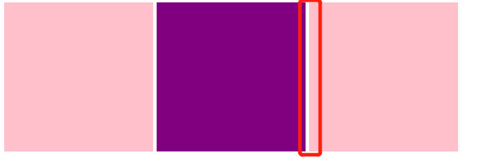

#### 什么是浮动

**概念：**元素的浮动是指**设置了浮动属性的元素**会

- 脱离标准普通流的控制
- 移动到指定的位置
- float属性会改变元素的display属性

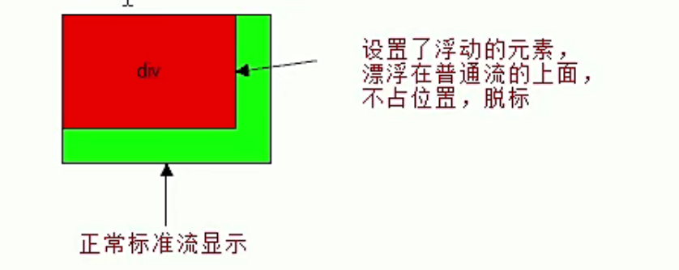

**作用：**

- 让**多个盒子(div)水平排列成一行**，使得浮动成为布局的重要手段
- 可以实现盒子的左右对齐等等
- 浮动最早用来**控制图片**，实现**文字环绕图片**的效果

**定义和用法**

float 属性定义元素在哪个方向浮动。以往这个属性总应用于图像，使文本围绕在图像周围，不过在 CSS 中，任何元素都可以浮动。浮动元素会生成一个块级框，而不论它本身是何种元素。

如果浮动非替换元素，则要指定一个明确的宽度；否则，它们会尽可能地窄。

**注释：**假如在一行之上只有极少的空间可供浮动元素，那么这个元素会跳至下一行，这个过程会持续到某一行拥有足够的空间为止。

**属性值**

| 值      | 描述                                                 |
| :------ | :--------------------------------------------------- |
| left    | 元素向左浮动。                                       |
| right   | 元素向右浮动。                                       |
| none    | 默认值。元素不浮动，并会显示在其在文本中出现的位置。 |
| inherit | 规定应该从父元素继承 float 属性的值。                |

```html
<style>
    /*浮动在标准流的上面*/
        div {
            width: 200px;
            height: 200px;
            background-color: pink;
            /*这句代码去掉也不会有影响*/
            display: inline-block;
        }

        .left {
            float: left;
        }

        .right {
            float: right;
        }
    </style>
```

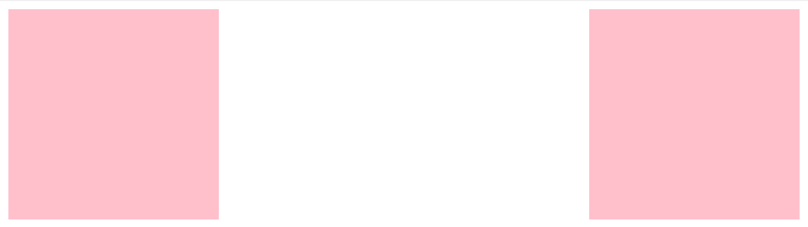

```html
<style>
    /*浮动在标准流的上面*/
     div {
        float: left;
        width: 200px;
        height: 200px;
        background-color: pink;
    }
    	
    .left {
        background-color: purple;
    }
</style>
```

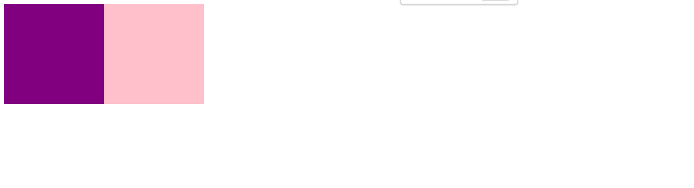

小细节：

因为浮动不占有位置，所以为了实现页面的正常布局，经常将浮动的盒子套一个标准流的父亲盒子


#### 浮动元素和父元素的关系

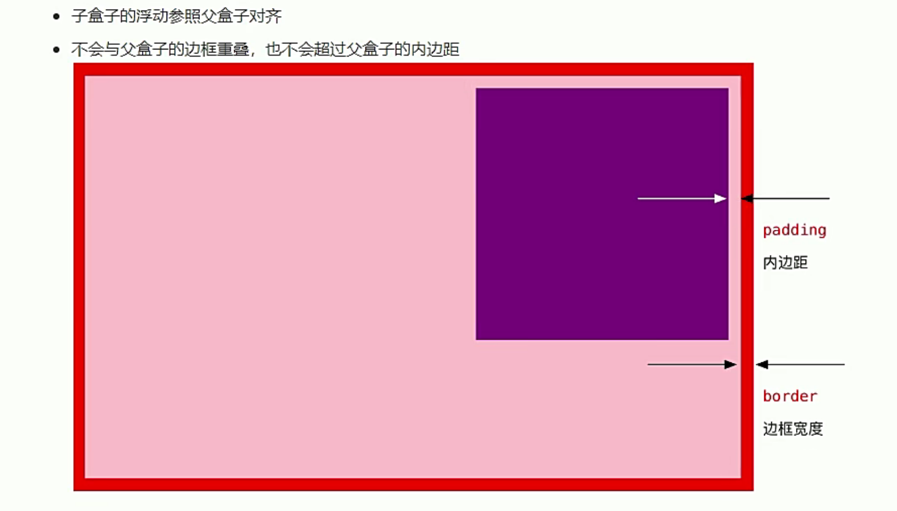

#### 浮动元素和兄弟盒子的关系

在一个父级盒子中，如果前一个盒子是：

- **浮动**的，那么**当前盒子**会与前一个盒子的顶部对齐
- **普通流**的，那么当前盒子会显示在前一个盒子的下方

> 浮动只会影响当前的或者是后面的标准流盒子，不会影响前面的标准流

**建议**：

> 如果一个子盒子浮动了，其他的子盒子应该也要浮动，防止出现问题


#### 清除浮动

##### 为什么要清除浮动

- 因为父级盒子很多情况下，不方便给高度，但是子盒子浮动就会不占有位置，最后父级盒子高度为0，就影响了下面的标准流的盒子
- 子盒子是标准流，即使父盒子没有高度，也会被子盒子撑开

##### 清除浮动的本质

**清除浮动主要是为了解决父元素因为子元素浮动而照成父元素高度为0的问题。清除了浮动子后，父元素就会根据子元素的高度设定自己的高度，父元素有了高度，就不会影响到下面的标准流了**


##### 清除浮动的方法

在CSS中，clear属性用于清除浮动

`选择器{clear: 属性值;} clear清除`

**属性值**

| 值      | 描述                                  |
| :------ | :------------------------------------ |
| left    | 在左侧不允许浮动元素。                |
| right   | 在右侧不允许浮动元素。                |
| both    | 在左右两侧均不允许浮动元素。          |
| none    | 默认值。允许浮动元素出现在两侧。      |
| inherit | 规定应该从父元素继承 clear 属性的值。 |

但实际工作中只使用`clear: both`


###### 额外标签法(隔墙法)

> 是W3C推荐的做法通过在最后一个浮动元素的后面添加一个空的标签例如`<div style="clear:both"></div>`或者其他元素，br等

- 优点：通俗易懂，书写方便
- 缺点：添加许多无用的标签，结构化较差

###### 父级添加overflow属性方法

给父级元素添加：`overflow: hidden|auto|scroll` 都可以实现

`hidden`:溢出隐藏

`auto`:溢出给一个竖直的滚动条

`scroll`:溢出会给一个水平和数值的滚动条

- 优点：代码简洁
- 缺点：内容增多时容易造成不会自动换行导致内容被隐藏掉，无法显示需要溢出的元素


###### 使用after伪元素清除浮动

**after方式为空元素额外标签法的升级版，好处是不用单独加标签了**

```css
/* 在clearfix类的属性生成一个元素在后面 */
.clearfix:after {
    content: "";
    display: block;
    height: 0;
    clear: both;
    visibility: hidden;
    
}
/*IE6、7专有*/
.clearfix {
    *zoom: 1;
}
```

- 优点：复合闭合浮动思想 结构语义化正确
- 缺点：由于IE6-7不支持after，使用zoom:1触发hasLayout


###### 使用双伪元素清除浮动

```css
.clearfix:before, 
.clearfix:after {
    content:"";
    display: table;
}

.clearfix:after {
    clear: both;
}

.clearfix {
    *zoom: 1;
}
```

- 优点：代码更加整洁
- 缺点：由于IE6-7不支持after，使用zoom:1触发hasLayout


##### CSS属性书写顺序

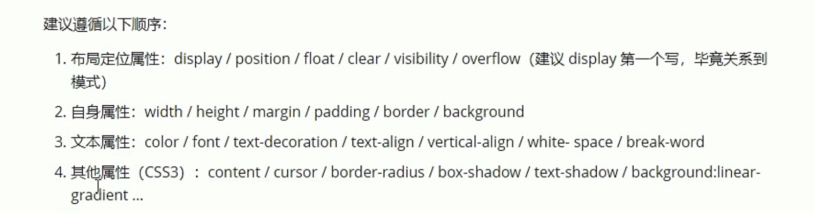

##### 布局流程

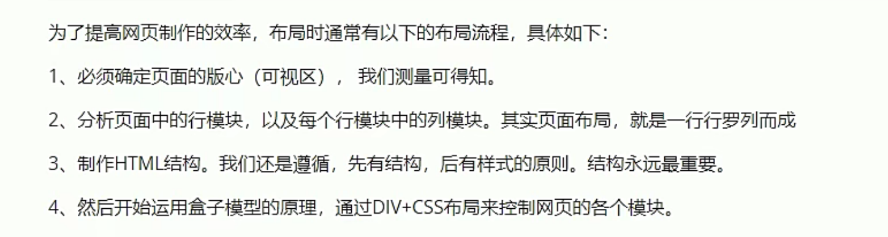


### 定位(position)

#### 为什么使用定位

> 将盒子定在某一个位置，自由的漂浮在其他盒子(包括标准流和浮动)的上面

标准流在底层-----浮动的盒子在中间层-----定位的盒子在最上层


#### 定位详解

定位也是用来布局的，它有两部分

`定位 = 定位模式 + 边偏移`

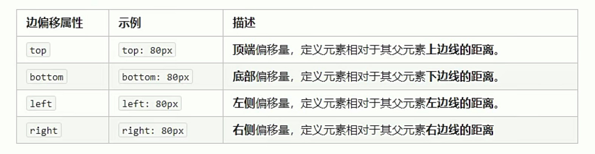

定位的盒子有了边偏移才有价值，凡是有定位的地方，就一定要有边偏移


#### 定位模式

在CSS中，通过`position`属性定义定位的模式

`选择器 {position: 属性值}`

**属性值**

| 值       | 语义     | 描述                                                         |
| :------- | -------- | :----------------------------------------------------------- |
| absolute | 绝对定位 | 生成绝对定位的元素，相对于 static 定位以外的第一个父元素进行定位。元素的位置通过 "left", "top", "right" 以及 "bottom" 属性进行规定。 |
| fixed    | 固定定位 | 生成绝对定位的元素，相对于浏览器窗口进行定位。元素的位置通过 "left", "top", "right" 以及 "bottom" 属性进行规定。 |
| relative | 相对定位 | 生成相对定位的元素，相对于其正常位置进行定位。因此，"left:20" 会向元素的 LEFT 位置添加 20 像素。 |
| static   | 静态定位 | 默认值。没有定位，元素出现在正常的流中（忽略 top, bottom, left, right 或者 z-index 声明）。 |
| inherit  |          | 规定应该从父元素继承 position 属性的值。                     |

##### 静态定位(static)-了解

- 静态定位是元素默认的定位方式，无定位的意思。它相当于border里面的none，不要定位的时候使用
- 静态定位按照标准流特训摆放位置，它没有边偏移
- 静态定位在布局时几乎不用

##### 相对定位(relative)-重要

- 相对定位是元素相对于它原来在标准流中的位置来说的

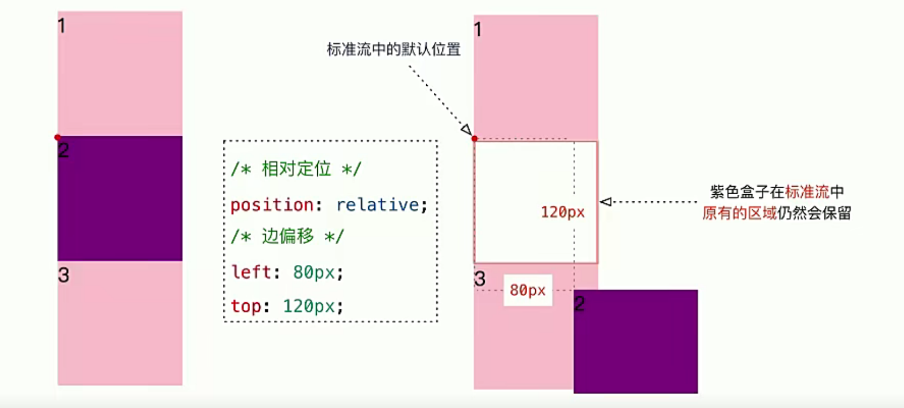
