# LINUX

## Linux的使用场景

### Linux下开发项目

- JavaEE
- 大数据
- Go
- Python
- PHP
- C/C++

### Linux运维工程师

- 服务器的规划
- 调式优化
- 系统的监控
- 故障的处理
- 数据备份
- 管理一个集群

### Linux嵌入式工程师

- 主要在linux环境下开发，C/C++

### Linux的应用领域

- 个人左面应用

- 服务器领域

  linux在服务器领域的应用是最强的(c/c++/php/java/python/go)

- 嵌入式领域

## Linux基础篇入门

linux是一个开源、免费的操作系统，其稳定性、安全性、处理多并发已经得到业界的认可，目前很多企业级的项目都会部署到linux/unix系统上

### 吉祥物Tux

### Linux的安装VM和Centos

- 先安装virtual machine 15.5

  <a href="https://www.vmware.com/cn.html">官网地址</a>

  <a href="https://www.nocmd.com/windows/740.html">其它地址</a>

- 安装Linux(Centos 7.6/Centos 8.1)

<a href="http://mirrors.aliyun.com/centos/7/isos/x86_64/">Centos 7.6 DVD版 4G</a>

<a href="http://mirrors.aliyun.com/centos/8/isos/x86_64/">Centos 8.1 AVA版 8G</a>

<a href="http://www.jsons.cn/randompwd">随机密码生成器</a>

## linux目录结构

### 具体的目录结构

- /bin[**常用]**（/usr/bin、/usr/local/bin）是Binary的缩写，这个目录存放着最经常使用的命令
- 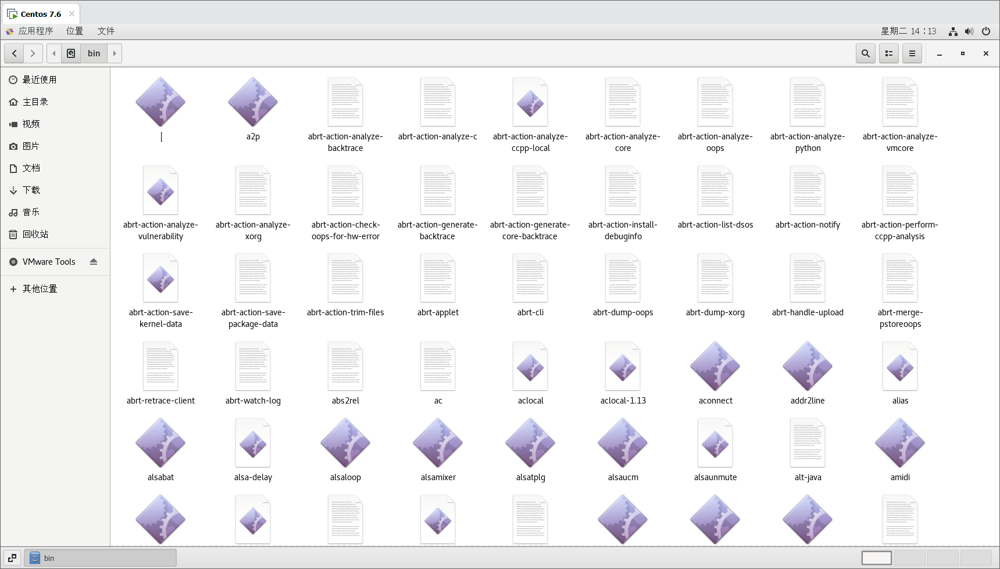

- /sbin[**常用**]（/usr/sbin、/usr/local/sbin）s就是Super User的意思，这里存放的是系统管理员使用的系统管理程序
- /home[**常用**]存放普通用户的主目录，在Linux中每个用户都有一个自己的目录，一般该目录名是以用户的账号命名
- 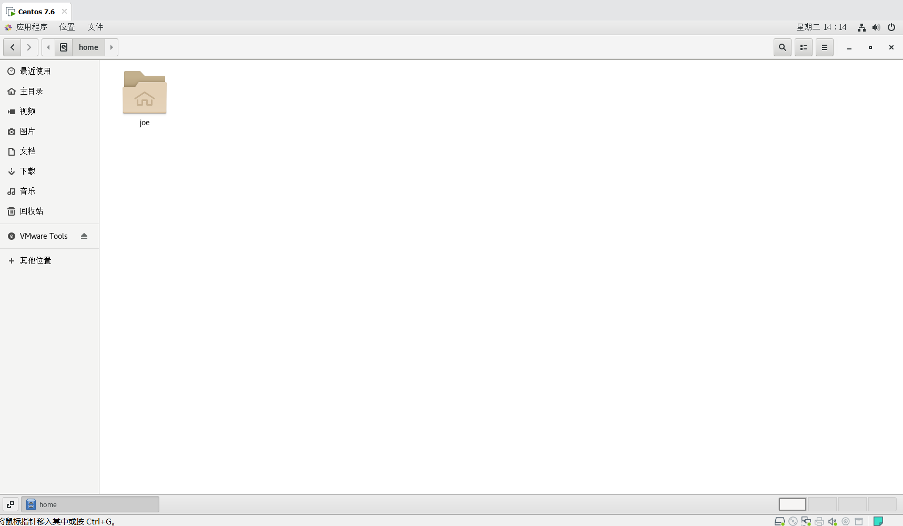
- /root[**常用**]该目录为系统管理员，也称超级权限者的用户主目录
- /lib 系统开机所需要最基本的动态连接共享库，其作用类似于Windows里的DLL文件，几乎所有的应用程序都需要用到这些共享库
- /lost+found这个目录一般情况下是空的，当系统非法关机后，这里就存放了一些文件
- 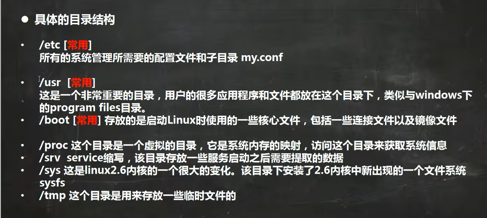
- 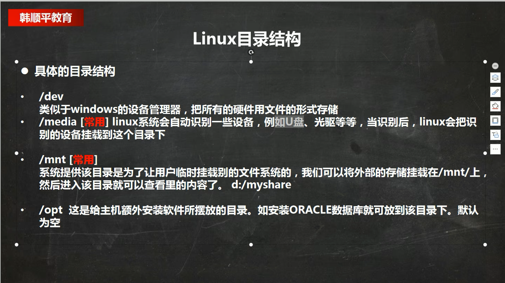
- 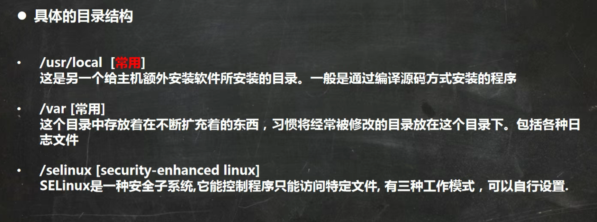

## Linux实际操作篇

### 远程登录Linux

#### 为什么需要远程登陆Linux

公司开发的时候，具体的使用场景是这样的：

- linux服务器是开发小组共享的
- 正式上线的项目是运行在公网
- 因此程序员需要远程登录到linux进行项目管理或者开发
- 远程登录客户端有Xshell6、Xftp6等

#### Xshell6

不能进行文件上传和下载

<a href="https:\\www.netsarang.com/en/free-for-home-school/">Xshell6、Xftp6下载地址</a>

**注意：**

- 安装时使用管理员身份运行

- 不要按照到C盘，节约C盘空间

- 远程登录Linux必须知道Linux的IP地址，`ifconfig`指令可以获取Linux的IP地址，`ping 192.168.2.129`ping通后才能远程连接

  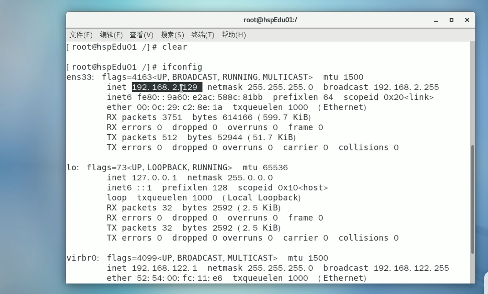

- 新建会话

  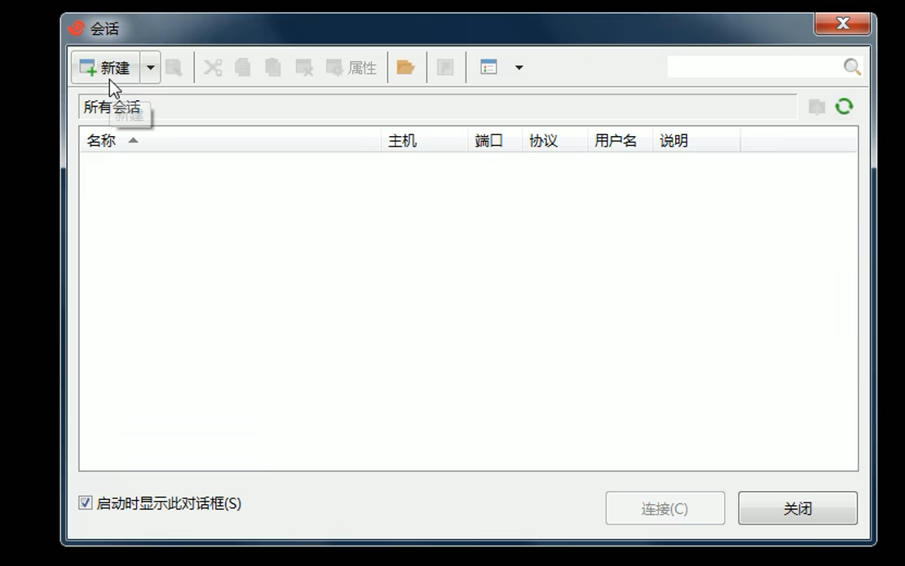

- 输入IP地址

  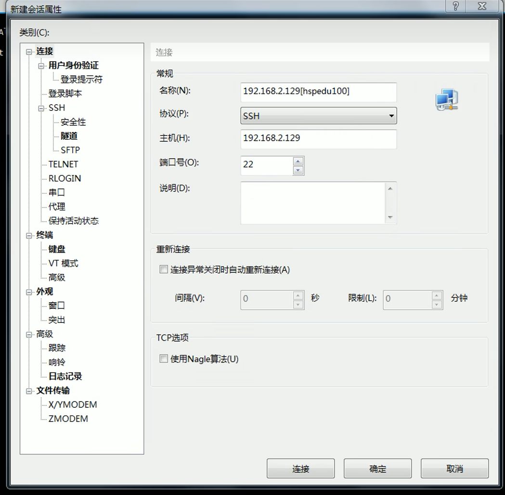

- 接受并保存

  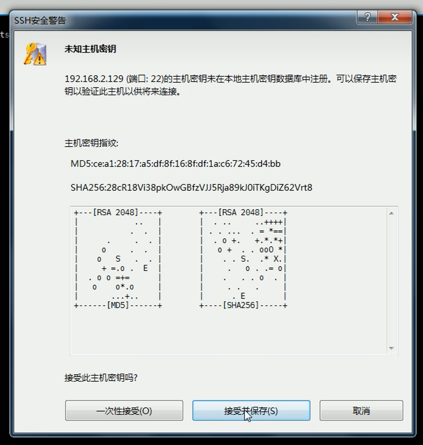

#### Xftp6

是一个基于windows平台的功能强大的SFTP、FTP文件传输软件，使用Xftp以后，windows用户能安全的在UNIX/Linux和Windows PC之间传输文件，Xftp6可能存在中文乱码

**注意：**

- 使用管理员身份运行

- 安装在C盘以外的盘符

- 新建-->输入Linux的IP地址-->协议最好选SFTP，端口22

- 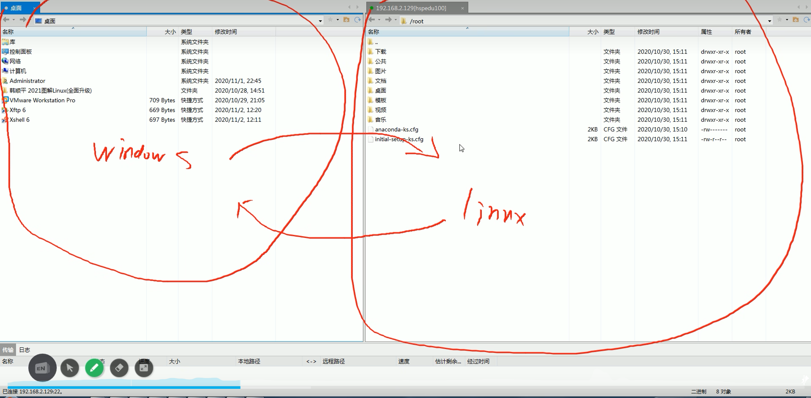

- 中文乱码解决：

  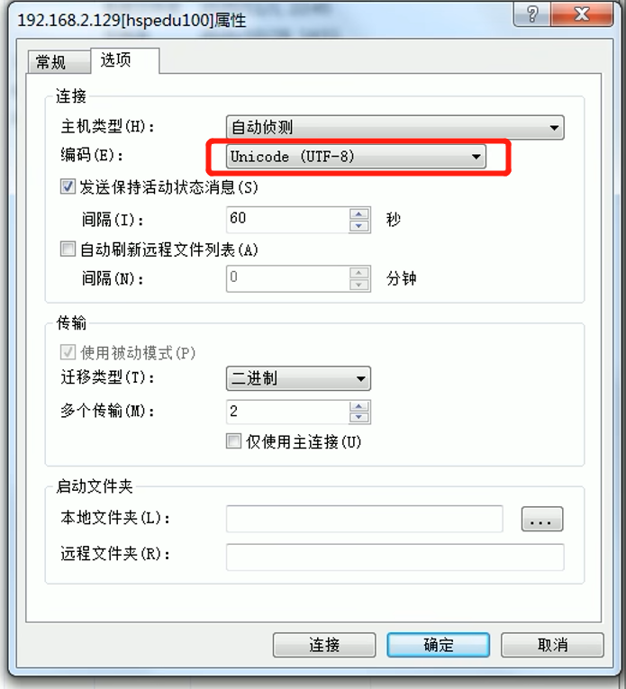

## Linux常用指令

### VI和VIM

#### vi和vim常用的三种模式

- 正常模式

  以vim打开一个档案就直接进入一般模式了(这是默认的模式)。在这个模式中，可以使用【上下左右】按键来移动光标，可以使用【删除字符】或【删除整行`dd`、`5dd删除当前行向下的5行`】来处理档案内容，也可以使用【复制`yy`或`5yy复制当前行向下的5行`、粘贴`p`、撤销`u`】来处理文件数据,【定位到首行`gg`、定位到尾行`G`、定位到行`20 shift g`】

  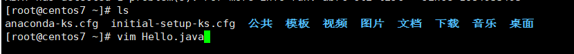

- 插入模式

  按下i、I、o、O、a、A、r、R等任何一个字母之后才会进入编辑模式，一般来说按i即可

  

- 命令行模式

  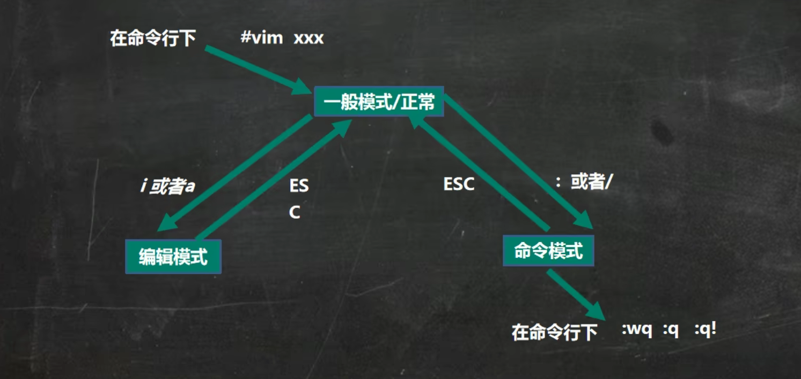

  输入`esc`退出插入模式

  输入`:`进入命令行模式

  `:q`退出不保存

  `:q!`强制退出不保存

  `:wq`写入并退出

  `/hello`在文档内部查找hello

  在这个模式当中，可以提供相关指令，完成读取、存盘、替换、离开vim、显示行号`:set nu`和`:set nonu`等的动作

#### 命令模式中常用

`:e file` --关闭当前编辑的文件，并开启新的文件。 如果对当前文件的修改未保存，vi会警告。
`:e! file` --放弃对当前文件的修改，编辑新的文件。
`:e+file` -- 开始新的文件，并从文件尾开始编辑。
`:e+n file` -- 开始新的文件，并从第n行开始编辑。
`:enew` --编译一个未命名的新文档。(CTRL-W n)
`:e` -- 重新加载当前文档。
`:e!` -- 重新加载当前文档，并丢弃已做的改动。
`:e#或ctrl+^ `-- 回到刚才编辑的文件，很实用。
`:f`或`ctrl+g` -- 显示文档名，是否修改，和光标位置。
`:f filename`-- 改变编辑的文件名，这时再保存相当于另存为。
`:w` -- 保存修改。
`:n1,n2w filename` -- 选择性保存从某n1行到另n2行的内容。
`:wq` -- 保存并退出。
`:x` -- 保存并退出。
`:quit` ——退出当前窗口。(CTRL-W q或CTRL-W CTRL-Q)
`:saveas newfilename` -- 另存为
2.vim常用快捷键
光标移动到行首：`gg`
光标移动到行尾：`G`
光标移动到文件开始：`GG`
光标移动到文件末尾：`shift +G`
先前翻页：`Ctrl+f`
向后翻页：`Ctrl+b`
删至行首：`d0`
删至行尾：`d$`
删除当前行及其后面n-1行：`ndd`
删除当前字符：`x`
删除当前字符的前一个字符：`X`
删除当前字符：`dl`
删除到第三个字符的结尾位置：`d3w`
删除到某个单词的末尾：`dw`
删除到某个单词的开始：`db`
删除当前行到文件的末尾：`dG`
删除当前行到文件第一行：`dH`
删除知道屏幕上最后一行：`dL`
恢复上一步操作：`u`
全部回复操作：`shift + u`
重做上一步操作：`Ctrl + r`
把下一行合并到当前行尾：`J`
选中当前行及其后面的n-1行：`nV`
复制当前光标到此单词末尾：`yw`
批量添加注释：`Ctrl+v`可视模式，上、下、左、右移动光标选择若干行开头；`Shift+i`进入插入模式；输入//或者；按`Esc`
批量去掉注释：`Ctrl+v`可视模式，上、下、左、右移动关闭选择要删除的注释符，如`//`或`#`；按`d`删除
横向打开另一个窗口：`:sp` 文件名
竖向打开另一个窗口：`:vsp` 文件名
关闭当前打开的所有窗口：`:qa`
`ZZ` -- 保存并退出。
选择当前字符所在的单词：`Ctrl+v`可视模式，然后`a+w`或`i+w`

选择当前字符所在的段落：`Ctrl+v`可视模视，然后`i+p`或`a+p`

### 系统信息Linux常用命令

`arch` 显示机器的处理器架构

`uname -m` 显示机器的处理器架构

`uname -r` 显示正在使用的内核版本

`dmidecode -q` 显示硬件系统部件 - (SMBIOS / DMI)

`hdparm -i /dev/hda` 罗列一个磁盘的架构特性

`hdparm -tT /dev/sda` 在磁盘上执行测试性读取操作

`cat /proc/cpuinfo` 显示CPU info的信息

`cat /proc/interrupts` 显示中断

`cat /proc/meminfo` 校验内存使用

`cat /proc/swaps` 显示哪些swap被使用

`cat /proc/version` 显示内核的版本

`cat /proc/net/dev` 显示网络适配器及统计

`cat /proc/mounts` 显示已加载的文件系统

`lspci -tv` 罗列 PCI 设备

`lsusb -tv` 显示 USB 设备

`date` 显示系统日期

`cal 2022` 显示2022年的日历表

`date 061217002022.00` 设置日期和时间 - 月日时分年.秒

`clock -w` 将时间修改保存到 BIOS

### 系统的关机、重启Linux、用户操作常用命令

`shutdown -h now` 立刻关闭系统

`halt`关机

`init 0` 关闭系统

`telinit 0` 关闭系统

`shutdown -h hours:minutes &` 按预定时间关闭系统

`shutdown -c` 取消按预定时间关闭系统

`shutdown -r now` 立刻重启

`reboot` 重启

`sync`把内存的数据同步到磁盘，关机和重启前都要`sync`

`logout` 注销

`su - userName`切换用户

高权限的用户切换到低权限的用户不需要输入密码，反之则需要

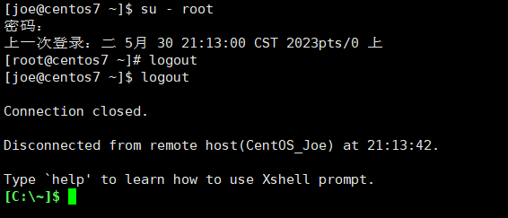

任何一个人在使用Linux系统的时候，都必须向管理员申请一个账号

`useradd 用户名`

- 当创建用户成功后，会自动的创建和用户同名的home目录
- 也可以通过`useradd -d指定目录 新的用户名`，给新创建的用户指定home目录

`passwd  用户名`修改密码

`userdel 用户名`删除用户 但是保留home/userName目录

`userdel -r userName`删除用户的同时删除home/userName目录

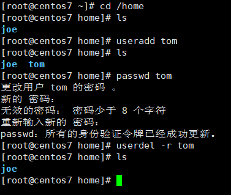

`id userName`查询用户信息

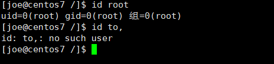

`whoami/who am i`查看当前登录的用户

### 目录操作Linux常用命令

#### 目录切换 cd

命令：`cd` 目录

`cd /` 切换到根目录

`cd /usr `切换到根目录下的usr目录

`cd ../ `切换到上一级目录 或者 cd ..

`cd ~` 切换到home目录

`cd - `切换到上次访问的目录

#### 目录查看 ls [-al]

命令：`ls [-al]`

`ls` 查看当前目录下的所有目录和文件

`ls -a` 查看当前目录下的所有目录和文件（包括隐藏的文件）

`ls -l` 或 ll 列表查看当前目录下的所有目录和文件（列表查看，显示更多信息）

`ls /dir` 查看指定目录下的所有目录和文件 如：ls /usr

#### 目录操作【增，删，改，查】

3.3.1创建目录【增】 `mkdir`

命令：`mkdir` 目录

`mkdir aaa` 在当前目录下创建一个名为aaa的目录

`mkdir /usr/aaa` 在指定目录下创建一个名为aaa的目录
3.3.2、删除目录或文件【删】rm

命令：rm [-rf] 目录

删除文件：

`rm` 文件 删除当前目录下的文件

`rm -f` 文件 删除当前目录的的文件（不询问）

删除目录：

`rm -r aaa` 递归删除当前目录下的aaa目录

`rm -rf aaa` 递归删除当前目录下的aaa目录（不询问）

全部删除：

`rm -rf *` 将当前目录下的所有目录和文件全部删除

`rm -rf /*` 【自杀命令！慎用！慎用！慎用！】将根目录下的所有文件全部删除

注意：rm不仅可以删除目录，也可以删除其他文件或压缩包，为了方便大家的记忆，无论删除任何目录或文件，都直接使用 rm -rf 目录/文件/压缩包
3.3.3、目录修改【改】`mv` 和 `cp`

重命名目录

命令：`mv` 当前目录 新目录

例如：`mv aaa bbb` 将目录`aaa`改为`bbb`

注意：`mv`的语法不仅可以对目录进行重命名而且也可以对各种文件，压缩包等进行 重命名的操作

剪切目录

命令：`mv` 目录名称 目录的新位置

示例：将`/usr/tmp`目录下的`aaa`目录剪切到 `/usr`目录下面 `mv /usr/tmp/aaa /usr`

注意：`mv`语法不仅可以对目录进行剪切操作，对文件和压缩包等都可执行剪切操作

拷贝目录

命令：`cp -r` 目录名称 目录拷贝的目标位置 -r代表递归

示例：将`/usr/tmp`目录下的`aaa`目录复制到 `/usr`目录下面` cp /usr/tmp/aaa /usr`

注意：`cp`命令不仅可以拷贝目录还可以拷贝文件，压缩包等，拷贝文件和压缩包时不 用写-r递归
3.3.4、搜索目录【查】`find`

命令：`find 目录 参数 文件名称`

示例：`find /usr/tmp -name 'a*' `查找/usr/tmp目录下的所有以a开头的目录或文件

### 文件操作Linux常用命

#### 文件操作【增，删，改，查】

新建文件【增】`touch`

命令：`touch` 文件名

示例：在当前目录创建一个名为`aa.txt`的文件 `touch aa.txt`

删除文件 【删】 `rm`

命令：`rm -rf` 文件名

修改文件【改】 `vi`或`vim`

【vi编辑器的3种模式】

基本上vi可以分为三种状态，分别是命令模式（`command mode`）、插入模式（`Insert mode`）和底行模式（`last line mode`），各模式的功能区分如下：

    命令行模式command mode） 控制屏幕光标的移动，字符、字或行的删除，查找，移动复制某区段及进入Insert mode下，或者到 last line mode。

命令行模式下的常用命令：

【1】控制光标移动：`↑，↓，j`

【2】删除当前行：`dd`

【3】查找：`/字符`

【4】进入编辑模式：`i o a`

【5】进入底行模式：`:`

    编辑模式（Insert mode）

只有在`Insert mode`下，才可以做文字输入，按`「ESC」`键可回到命令行模式。 编辑模式下常用命令：

【1】`ESC` 退出编辑模式到命令行模式；

    底行模式（last line mode）

将文件保存或退出`vi`，也可以设置编辑环境，如寻找字符串、列出行号……等。 底行模式下常用命令：

【1】退出编辑不保存： `:q`

【2】强制退出不保存：` :q!`

【3】保存并退出：` :wq`

打开文件

命令：`vi` 文件名 示例：打开当前目录下的`aa.txt`文件 `vi aa.txt `或者 `vim aa.txt`

注意：使用`vi`编辑器打开文件后，并不能编辑，因为此时处于命令模式，点击键盘`i/a/o`进入编辑模式。

编辑文件

使用vi编辑器打开文件后点击按键：`i ，a`或者`o`即可进入编辑模式。

`i`在光标所在字符前开始插入

`a`:在光标所在字符后开始插入

`o`:在光标所在行的下面另起一新行插入

保存或者取消编辑

保存文件：

第一步：`ESC` 进入命令行模式

第二步：: 进入底行模式

第三步：`wq` 保存并退出编辑

取消编辑：

第一步：`ESC` 进入命令行模式

第二步：: 进入底行模式

第三步：`q!` 撤销本次修改并退出编辑

文件的查看【查】

文件的查看命令：`cat/more/less/tail`

`cat`：看最后一屏

示例：使用`cat`查看`/etc/sudo.conf`文件，只能显示最后一屏内容 `cat sudo.conf`

`more`：百分比显示

示例：使用`more`查看`/etc/sudo.conf`文件，可以显示百分比，回车可以向下一行，空格可以向下一页，q可以退出查看

`more sudo.conf`

`less`：翻页查看

示例：使用`less`查看`/etc/sudo.conf`文件，可以使用键盘上的PgUp和PgDn向上 和向下翻页，`q`结束查看

`less sudo.conf`

`tail`：指定行数或者动态查看

示例：使用`tail -10` 查看`/etc/sudo.conf`文件的后10行，`Ctrl+C`结束` tail -10 sudo.conf`

#### 权限修改

`rwx`：`r`代表可读，`w`代表可写，`x`代表该文件是一个可执行文件，**如果rwx任意位置变为-则代表不可读或不可写或不可执行文件**。

示例：给aaa.txt文件权限改为可执行文件权限，aaa.txt文件的权限是-`rw`-------

第一位：`-`就代表是文件，`d`代表是文件夹

第一段（3位）：代表拥有者的权限

第二段（3位）：代表拥有者所在的组，组员的权限

第三段（最后3位）：代表的是其他用户的权限

### 压缩文件操作Linux常用命令

#### 打包和压缩

Windows的压缩文件的扩展名` .zip/.rar`

linux中的打包文件：`aa.tar`

linux中的压缩文件：`bb.gz`

linux中打包并压缩的文件：`.tar.gz`

Linux中的打包文件一般是以`.tar`结尾的，压缩的命令一般是以`.gz`结尾的。 而一般情况下打包和压缩是一起进行的，打包并压缩后的文件的后缀名一般`.tar.gz`。

命令：`tar -zcvf` 打包压缩后的文件名 要打包的文件

其中：`z`：调用`gzip`压缩命令进行压缩

`c`：打包文件

`v`：显示运行过程

`f`：指定文件名

示例：打包并压缩/usr/tmp 下的所有文件 压缩后的压缩包指定名称为xxx.tar `tar -zcvf ab.tar aa.txt bb.txt` 或：`tar -zcvf ab.tar *`

#### 解压

命令：`tar [-zxvf]` 压缩文件

其中：`x`：代表解压

示例：将/usr/tmp 下的ab.tar解压到当前目录下

示例：将/usr/tmp 下的ab.tar解压到根目录/usr下

tar -xvf ab.tar -C /usr------C代表指定解压的位置

#### 查找命令Linux常用命令

`grep`

`grep`命令是一种强大的文本搜索工具

使用实例：

`ps -ef` | `grep sshd` 查找指定ssh服务进程

`ps -ef` |` grep sshd` | `grep -v grep` 查找指定服务进程，排除gerp身

`ps -ef` | `grep sshd -c` 查找指定进程个数
`find`

`find`命令在目录结构中搜索文件，并对搜索结果执行指定的操作。

`find` 默认搜索当前目录及其子目录，并且不过滤任何结果（也就是返回所有文件），将它们全都显示在屏幕上。

使用实例：

`find . -name "*.log" -ls` 在当前目录查找以.log结尾的文件，并显示详细信息。

`find /root/ -perm 600` 查找/root/目录下权限为600的文件

`find . -type f -name "*.log"` 查找当目录，以.log结尾的普通文件

`find . -type d | sort` 查找当前所有目录并排序

`find . -size +100M` 查找当前目录大于100M的文件

#### locate

`locate` 让使用者可以很快速的搜寻某个路径。默认每天自动更新一次，所以使用locate 命令查不到最新变动过的文件。为了避免这种情况，可以在使用`locate`之前，先使用`updatedb`命令，手动更新数据库。如果数据库中没有查询的数据，则会报出`locate: can not stat ()`

`/var/lib/mlocate/mlocate.db`: No such file or directory该错误！updatedb即可！

`yum -y install mlocate` **如果是精简版CentOS系统需要安装locate命令**

使用实例：

updatedb

locate /etc/sh 搜索etc目录下所有以sh开头的文件

locate pwd 查找和pwd相关的所有文件

### whereis

`whereis`命令是定位可执行文件、源代码文件、帮助文件在文件系统中的位置。这些文件的属性应属于原始代码，二进制文件，或是帮助文件。

使用实例：

`whereis ls` 将和ls文件相关的文件都查找出来

### which

`which`命令的作用是在`PATH`变量指定的路径中，搜索某个系统命令的位置，并且返回第一个搜索结果。

使用实例：

`which pwd` 查找`pwd`命令所在路径

`which java` 查找`path`中`java`的路径

### su、sudo

`su`

`su`用于用户之间的切换。但是切换前的用户依然保持登录状态。如果是root 向普通或虚拟用户切换不需要密码，反之普通用户切换到其它任何用户都需要密码验证。

`su test`:切换到test用户，但是路径还是/root目录

`su - test` : 切换到test用户，路径变成了/home/test

`su` : 切换到root用户，但是路径还是原来的路径

`su -` : 切换到root用户，并且路径是/root

su不足`：如果某个用户需要使用root权限、则必须要把root密码告诉此用户。

退出返回之前的用户：`exit`
`sudo`

`sudo`是为所有想使用root权限的普通用户设计的。可以让普通用户具有临时使用root权限的权利。只需输入自己账户的密码即可。

进入sudo配置文件命令：

`vi /etc/sudoer`或者`visudo`

案例：

允许hadoop用户以root身份执行各种应用命令，需要输入hadoop用户的密码。 hadoop ALL=(ALL) ALL

案例：

只允许hadoop用户以root身份执行ls 、cat命令，并且执行时候免输入密码。 配置文件中：

hadoop ALL=NOPASSWD: /bin/ls, /bin/cat

### 系统服务

`service iptables status` --查看iptables服务的状态

`service iptables start` --开启iptables服务

`service iptables stop` --停止iptables服务

`service iptables restart` --重启iptables服务

`chkconfig iptables off` --关闭iptables服务的开机自启动

`chkconfig iptables on` --开启iptables服务的开机自启动

### 网络管理Linux常用命令

1、主机名配置

`[root@node1 ~]# vi /etc/sysconfig/network`

`NETWORKING=yes`

`HOSTNAME=node1`

2、IP 地址配置

`[root@node1 ~]# vi /etc/sysconfig/network-scripts/ifcfg-eth0`

3、域名映射

/etc/hosts文件用于在通过主机名进行访问时做ip地址解析之用。所以，你想访问一个什么样的主机名，就需要把这个主机名和它对应的ip地址。

`[root@node1 ~]# vi /etc/hosts`

在最后加上

`192.168.52.201 node1`

`192.168.52.202 node2`

`192.168.52.203 node3`

### 定时任务指令crontab 配置Linux常用命令

`crontab`是Unix和Linux用于设置定时任务的指令。通过crontab命令，可以在固定间隔时间,执行指定的系统指令或shell脚本。时间间隔的单位可以是分钟、小时、日、月、周及以上的任意组合。

crontab安装：

`yum install crontabs`

服务操作说明：

`service crond start` ## 启动服务

`service crond stop` ## 关闭服务

`service crond restart` ## 重启服务
命令格式

`crontab [-u user] file`

`crontab [-u user] [ -e | -l | -r ]`

参数说明：

`-u user`：用来设定某个用户的crontab服务

`file`：file是命令文件的名字,表示将file做为crontab的任务列表文件并载入crontab。

`-e`：编辑某个用户的crontab文件内容。如果不指定用户，则表示编辑当前用户的crontab文件。

`-l`：显示某个用户的crontab文件内容。如果不指定用户，则表示显示当前用户的crontab文件内容。

`-r`：删除定时任务配置，从/var/spool/cron目录中删除某个用户的crontab文件，如果不指定用户，则默认删除当前用户的crontab文件。

命令示例：

`crontab file [-u user]` ## 用指定的文件替代目前的crontab

`crontab -l [-u user]` ## 列出用户目前的crontab

`crontab -e [-u user]` ## 编辑用户目前的crontab
配置说明

命令：`* * * * * command`

解释：分 时 日 月 周 命令

第1列表示分钟1～59 每分钟用*或者 */1表示

第2列表示小时0～23（0表示0点）

第3列表示日期1～31

第4列表示月份1～12

第5列标识号星期0～6（0表示星期天）

第6列要运行的命令

### 其他Linux常用命令

查看当前目录：`pwd`

命令：`pwd `查看当前目录路径

查看进程：`ps -ef`

命令：`ps -ef` 查看所有正在运行的进程

结束进程：`kill`

命令：`kill pid` 或者 kill -9 pid`(强制杀死进程) pid:进程号

网络通信命令：

`ifconfig`：查看网卡信息

命令：`ifconfig` 或 ifconfig | more`

`ping`：查看与某台机器的连接情况

命令：`ping ip`

`netstat -an`：查看当前系统端口

命令：`netstat -an`

搜索指定端口

命令：`netstat -an | grep 8080`

配置网络

命令：`setup`

重启网络

命令：`service network restart`

切换用户

命令：`su -` 用户名

关闭防火墙

命令：`chkconfig iptables off`

或者：

`iptables -L`;

`iptables -F`;

`service iptables stop`

修改文件权限

命令：`chmod 777`

清屏

命令：`ctrl + l`

vi模式下快捷键

`esc`后:

保存并退出快捷键：`shift+z+z`

光标跳到最后一行快捷键：`shift+g`

删除一行：`dd`

复制一行内容：`y+y`

粘贴复制的内容：`p`
